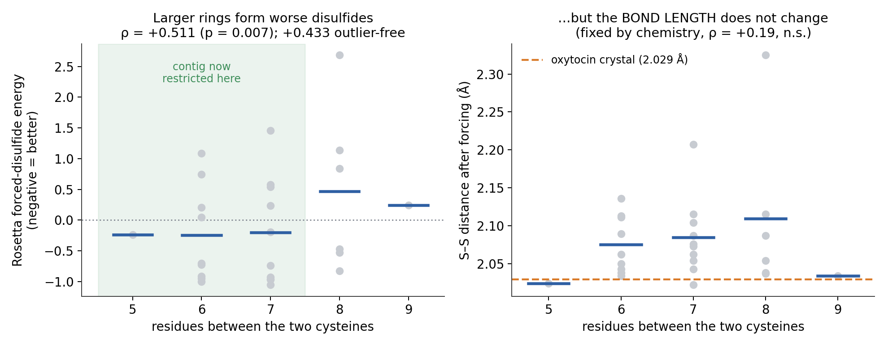
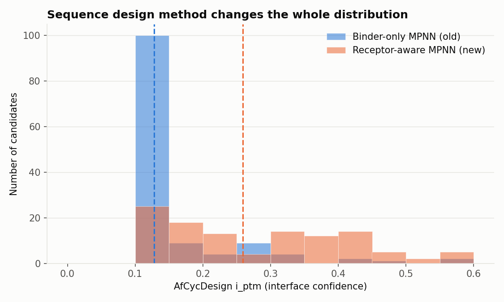
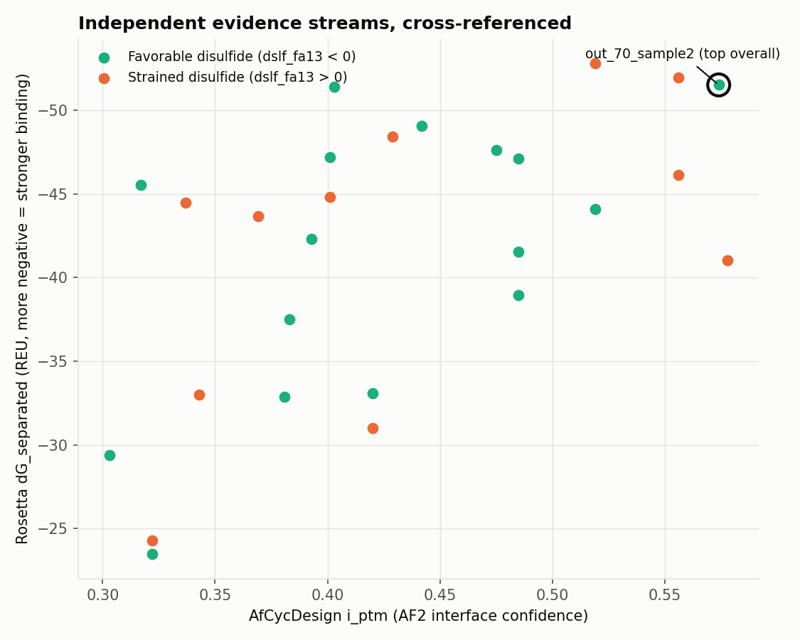
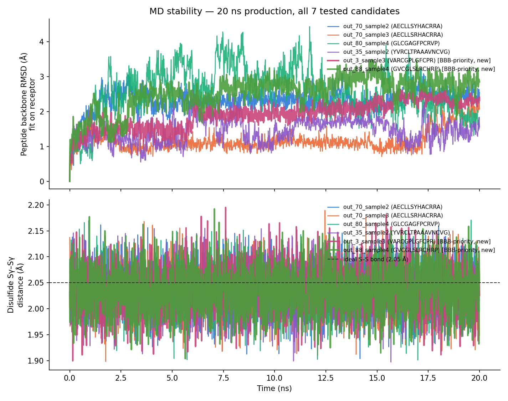

# Methods and Results

**Document version:** v1.1.0
**Last updated:** 2026-09-25
**Describes pipeline:** v3.1.0

The complete technical record: what each stage does, exactly how it is
configured, what it produced, and what the controls say about whether to believe
it. Written so that someone who reads it end to end understands every part of
the project, and so that any number quoted elsewhere can be traced to its
source here.

**How this fits with the other documents.** [`SUMMARY.md`](SUMMARY.md) is the
narrative — read that first. This document is the evidence behind it.
[`sampling_parameter_derivation.md`](sampling_parameter_derivation.md) derives
*why each number is that number*; this document reports *what happened when we
used it*. [`LIMITATIONS.md`](LIMITATIONS.md) catalogues what is still weak.
[`SOP.md`](SOP.md) is the runbook.

Each stage below follows the same shape: **Method** → **Configuration** →
**Results** → **Controls** → **Verdict**.

### Version history

| Version | Date | Summary |
|---|---|---|
| **v1.0.0** | 2026-09-24 | Restructured from `PIPELINE_VALIDATION.md` into the pipeline's complete technical reference. Reordered into funnel order; corrected the Stage 5 funnel counts and the Stage 3 oxytocin interpretation; removed material now owned by `LIMITATIONS.md` and the derivation document; added the 2026-09-24 work (cysteine constraint, deduplication, backbone scouting, disulfide ring size, BBB gate control) and eight new figures. |

---

## 1. The target and how the receptor is prepared

**Structure.** All work uses **PDB 7RYC** — OXTR bound to oxytocin in complex
with heterotrimeric Gq, solved by cryo-EM. Chain `O` is the receptor, chain `L`
is oxytocin.

**Receptor definition, verified rather than assumed.** Chain O is resolved from
residue 31 to 345, with gaps at residue 68 and residues 237–265. The second gap
is ICL3, an intracellular loop that is disordered in most GPCR structures and
irrelevant to ligand binding. Residues 1–30 — the extracellular N-terminus — are
not resolved in the map at all, so no design has ever seen them.

The RFdiffusion contig therefore specifies `O31-67/O69-236/O266-345`, which
matches the resolved density exactly. Nothing was truncated by choice.

**Hotspot residues.** The eight residues given to RFdiffusion as the surface to
engage — `O96, O295, O299, O38, O188, O34, O200, O316` — were computed as the
receptor residues within contact distance of any oxytocin (chain L) atom, ranked
by closest approach. They are measured contacts, not hand-picked.

**Independent verification.** Superposing an AfCycDesign prediction back onto
7RYC gives a receptor Cα RMSD of **0.74 Å**, and predicted peptides land in the
orthosteric pocket rather than on the lipid-facing surface. The receptor
preparation is sound.

**The one deliberate limitation.** 7RYC is an *active-state, agonist-bound,
G-protein-coupled* conformation. Designing into it biases toward an
agonist-competent pocket. An antagonist-bound structure (6TPK) exists but is not
in use. See [`LIMITATIONS.md`](LIMITATIONS.md) A5.

---

## 2. Stage 1 — Backbone generation (RFdiffusion)

### Method

RFdiffusion is a denoising diffusion model over protein backbone coordinates.
Conditioned on a target structure and hotspot residues, it generates backbone
geometries complementary to that surface. It outputs **backbone atoms only** —
every diffused residue is written as glycine, because sequence is not its job.

The key capability here is **motif scaffolding**: specified residues can be held
at their real coordinates while the rest of the chain is generated around them.

### Configuration

```
contigmap.contigs=[1-3/L1-1/4-6/L6-6/1-3 O31-67/O69-236/O266-345/0]
ppi.hotspot_res=['O96','O295','O299','O38','O188','O34','O200','O316']
diffuser.T=50
inference.input_pdb=7RYC.pdb
```

Reading the contig: 1–3 free residues, then **oxytocin's Cys1** as a fixed
motif residue, then 4–6 free residues, then **oxytocin's Cys6**, then 1–3 free
residues — followed by the receptor chain. The two cysteines are planted from
the real structure; the peptide is grown around them.

Confirmed directly in the output: chain L of every backbone is glycine
everywhere except two CYS positions, which vary per backbone with contig
sampling (backbone 0 has them at positions 2 and 11, backbone 37 at 3 and 9).

### Results

100 backbones in the pilot, at **85.8 s/backbone** measured. Peptide lengths
range 8–16 residues.

### Controls — disulfide geometry

The spacer sets the macrocycle ring size, which raises a question: does
separating the cysteines further in sequence damage the disulfide?



**The bond length does not change.** A disulfide is a covalent bond fixed by
chemistry at ~2.03 Å. Measured across the shortlist: 2.083 ± 0.063 Å, with no
significant dependence on separation (ρ = +0.19, n.s.). Reference geometry from
7RYC chain L: Cα–Cα 4.227 Å, Cβ–Cβ 4.063 Å, **S–S 2.029 Å**.

**Ring strain does change.** Rosetta's forced-disulfide energy degrades as the
cysteines separate — **ρ = +0.511 (p = 0.007)**, still **+0.433 (p = 0.031)**
with the two known outliers removed, so it is not outlier-driven. Mean energy by
separation: 5 → −0.237, 6 → −0.246, 7 → −0.203, **8 → +0.472**, 9 → +0.244
(negative is better). Favourable bonds: 12/20 at separations 5–7, only 3/7 at
8–9. Both of the worst candidates in the shortlist are separation-8 designs.

Measured Cα–Cα distance rises monotonically with separation across the 100
backbones: 4.79 Å at separation 5 to 5.43 Å at separation 9, all within the
4.34–6.53 Å range real disulfides occupy.

### Verdict

Sound, with the spacer now restricted to `4-6` (separations 5–7, bracketing
oxytocin's native 5). This is a prior, not a filter — all backbones now generate
in the favourable regime rather than roughly half.

---

## 3. Stage 2 — Sequence design (ProteinMPNN)

### Method

ProteinMPNN is a message-passing graph neural network that solves the inverse
folding problem: given backbone coordinates, which amino acid sequence is most
likely to adopt them? Sampling temperature controls diversity — low temperature
gives confident, repetitive sequences; high temperature gives varied, lower-
quality ones.

### Configuration

```
--pdb_path run/out/out_N.pdb  --pdb_path_chains L
--fixed_positions_jsonl mpnn_out/fixed_out_N.jsonl
--num_seq_per_target 300  --sampling_temp 0.1
```

Two configuration details carry the whole stage.

**Receptor-aware design.** `--pdb_path_chains L` designates chain L as the
designed chain while the receptor remains as context. An earlier version passed
only the binder chain, so sequences were designed for the peptide's shape in
isolation rather than for complementarity to OXTR. Fixing this raised interface
scores materially and is the single most consequential correction in the
project.

**Fixed cysteine positions.** `--fixed_positions_jsonl` pins the two motif
cysteines so they survive into the designed sequence.

### Controls — the silent failure

**ProteinMPNN does not error when the fixed-positions file is missing.** It
exits 0, prints no warning, and designs the cysteines away:

```
with    fixed positions -> PCVTPPALQLCREA   (2 Cys)
without fixed positions -> PPVTPPAFQLRREA   (0 Cys, exit code 0)
```

Nothing in the repository generated those files. This produced the pilot's
1/400 cyclizable Stage 2 output and the original D_s(T) experiment's 0/2400.
Both datasets consisted of molecules that cannot cyclize.

Now guarded at two points: `make_fixed_positions.py` generates the files and
refuses any backbone not carrying exactly two cysteines; `validate_cys.py` is a
Stage 2 gate that verifies every sequence carries ≥2 cysteines at the pinned
positions and exits non-zero otherwise (verified: exit 1 on the unconstrained
data, exit 0 on the constrained data).

### Results — sampling temperature

Temperature was chosen by experiment, not convention: 32 backbones × 7
temperatures × 300 draws, Cys-constrained and receptor-aware.


**T = 0.1 is the peak**, at 31.2 mean distinct-and-good sequences per backbone.
Above T = 0.3 essentially nothing survives the quality bar; below it diversity
collapses.


Per-backbone diversity varies enormously — D_s ranges from 2 to 197 at T = 0.1,
mean 37.6 (95% CI [22.6, 52.6]). **D_s is not a constant**, which the original
model assumed.


### Results — deduplication

ProteinMPNN at low temperature repeats itself heavily. From 53 draws per
backbone, only **34.2 are unique on average (35% duplicates)**, ranging from 12
to 49 across backbones. Cross-backbone duplication adds a further ~3%.

Because ProteinMPNN costs **0.027 s/sequence** against RFdiffusion's 85.8 s per
backbone — a factor of 3,178 — sequences are effectively free and there is no
reason to ration them. At 300 draws a backbone yields ~36.9 distinct-and-good
sequences, essentially its full complement, for 8 seconds of compute.

Deduplication runs within each backbone, then globally, before any docking.

### Verdict

Sound once gated. **S = 300 draws, T = 0.1**, deduplicated, Cys-verified.

---

## 4. Stage 3 — Structure prediction and docking

### Method

Two independent predictors fold each designed sequence against the receptor.

**AfCycDesign** is an AlphaFold2 derivative (via ColabDesign) adapted for cyclic
peptides. Run in `binder` mode with the receptor as a fixed template, it
predicts the complex and reports `i_ptm` — a confidence score for the interface
specifically, as distinct from `pLDDT` which scores local structure.

**Boltz2** is an independent co-folding model, run with an explicit covalent
bond constraint for the disulfide.

### Configuration

```python
model = mk_afdesign_model(protocol="binder")
model.prep_inputs(pdb_filename="7RYC.pdb", target_chain="O", binder_len=len(seq))
model.predict(seq=seq, models=["model_1_ptm"], num_recycles=3)
```

Measured cost: **27.7 s/run** (AfCycDesign), **42.1 s/run** (Boltz2, of which
~29 s is model loading that batching would amortise).

Note that `hotspot=` has no effect at prediction time — it shapes the design
loss only. Verified: predictions with and without it are identical to seven
decimal places.

### Results



Cys-constrained v2 candidates (n = 112): mean i_ptm 0.283, median 0.259,
max 0.580. All carry ≥2 cysteines (76 with exactly 2, 28 with 3, 8 with 4).

### Controls — what i_ptm actually measures

**Oxytocin, the native ligand, scores i_ptm 0.368** — below the shortlist
average. This looks alarming and is the most misread result in the project.

Investigated directly: superposing the prediction onto 7RYC (receptor RMSD
0.74 Å) shows the predicted peptide centroid sits 7.0 Å from the crystal pose,
with Cys1 only 3.1 Å off — but the C-terminal tail diverges badly, 10.4 Å at
Pro7 rising to 20.7 Å at Gly9, and the disulfide never closes (9.2 Å predicted
against 2.029 Å crystallographic).

**So i_ptm is correctly reporting low confidence in a pose it got partly wrong.**
It is not failing to recognise a good binder. Two alternative explanations were
tested and rejected: it is not a length artefact (i_ptm vs length gives ρ = −0.19
across the shortlist, the wrong direction), and not a conditioning artefact
(hotspot conditioning has no effect at prediction time).

**i_ptm does carry real signal.** Against Rosetta interface energy across the
27-candidate shortlist, ρ = **−0.532**; controlling for interface area, partial
ρ = −0.369 (n = 27, p ≈ 0.06 — suggestive, not established).

It is used as a **prior, not a gate**.

### Controls — Boltz2 cannot rank these molecules

Boltz2 returns `iptm` 0.88–0.98 for essentially everything, including negative
controls and oxytocin (0.959). Three explanations were tested:

| Hypothesis | Test | Outcome |
|---|---|---|
| MSA-pairing bug (upstream issue #627) | Re-run with proper paired MSA | Rejected — negative control scored *higher* |
| Explicit disulfide constraint inflating confidence | Re-run without the bond | Rejected — 0.010 gap, far too small |
| Reading the wrong matrix direction | Extract both directions across 304 runs | **Confirmed as the mechanism** |

`pair_chains_iptm` is asymmetric. The pipeline reads the direction normalised on
the 285-residue receptor, which saturates; the peptide-normalised direction sits
~0.13 lower with more spread (sd 0.059 vs 0.036). **But recovering it does not
rescue the metric** — the negative control still outscores the good candidate
(0.885 vs 0.840), and correlation with Rosetta energy remains noise (ρ = +0.16).

Boltz2 is retained for **pose agreement only**, never ranking.

### Controls — pose agreement does discriminate

Confidence scores had been compared between the two tools, but never whether
they put the peptide in the same place. Two independently-trained models landing
on the same pose is real corroborating evidence; disagreement flags exactly the
kind of unreliable prediction the oxytocin control showed is possible.

**Method.** Superpose each candidate's AfCycDesign and Boltz2 receptor chains
(Kabsch fit on backbone atoms — no sequence alignment needed, since both predict
from the identical extracted 7RYC receptor sequence), apply that transform to
each structure's peptide chain, then measure peptide backbone RMSD between the
two aligned poses. Data: `analysis/stage_0_controls/afcyc_vs_boltz2_pose_rmsd.csv`.

**Caveat, and it matters.** The receptor-chain fit residual is itself ~3.0–3.6 Å
across every candidate, uniformly — the two tools do not fully agree on the
receptor's conformation either. Part of the peptide RMSD therefore reflects that
baseline rather than peptide placement. Because the baseline is roughly constant
across candidates the metric remains informative **relatively**, but it is not a
clean peptide-only measurement and should not be quoted as one.

**Results.** Mean peptide-pose RMSD 6.9 Å, median 6.6 Å across the 27 — modest
overall agreement. Best: `out_70_sample3` at **2.60 Å**, one of the MD-validated
leads. Worst by a wide margin: **the entire `out_39` design family** —
`out_39_sample3` (15.51 Å), `out_39_sample1` (13.65 Å), `out_39_sample2`
(13.40 Å), clustered far from every other candidate.

**This is the check that caught the negative control.** `out_39_sample3` is the
same candidate MD could not distinguish from the good ones — it looked equally
stable over 20 ns. Pose agreement separated it, and its two siblings with it, at
near-zero marginal cost since it reuses structures already computed.

### The backbone effect, and how docking is allocated

The most consequential result in this stage is not about any one tool.


Grouping candidates by their parent backbone and decomposing the variance:
**ICC(1) = 0.562**, F = 5.06 on (29, 65) df, **p = 2.9 × 10⁻⁸**. Fifty-six
percent of the variance in interface score sits *between* backbones rather than
between sequences sharing one. Backbone means span 0.401 to 0.110 — more than
three times the individual-candidate standard deviation.

This means a backbone's quality can be estimated from a few designs, which makes
a two-stage allocation possible.


**Scout** six randomly-chosen designs per backbone (reliability 0.885 at the
point estimate, 0.773 at the CI lower bound), rank backbones by *mean* i_ptm,
then **deepen the top 50%** — which recovers **99.2%** of genuinely top-quintile
backbones, against 75.9% at a 20% cut. Roughly 15,000 dockings instead of
39,750, and ~36 GPU-hours instead of 193.

The scout sample must be random: the estimand is the backbone mean, so taking
"the first six" or "the best six by ProteinMPNN score" biases it.

### Verdict

AfCycDesign i_ptm is a usable prior. Boltz2 is structure-only. Backbone
scouting is the allocation strategy. All three conclusions rest on controls
rather than assumption.

---

## 5. Stage 4 — Physics-based scoring (Rosetta)

### Method

Each candidate complex is relaxed with PyRosetta `FastRelax`, then scored with
`InterfaceAnalyzer` to give `dG_separated` — the energy difference between bound
and separated states, with `-pack_separated true` so the unbound state is
repacked rather than simply pulled apart.

Separately, the disulfide is **forced**: the bond is explicitly patched in with
`form_disulfide` before relaxation, and the resulting geometry and energy
compared against unforced auto-detection. This tests whether the designed bond
is actually formable.

### Results



Across the 27-candidate shortlist, `dG_separated` spans −23.5 to −52.8 REU.
Measured cost: **1,245 s/candidate**.

Disulfide forcing: 25 of 27 candidates support their designed bond better than
AfCycDesign's blind prediction supported oxytocin's real one. Mean forced S–S
distance 2.083 Å. One clear outlier, `out_17_sample3` (forced energy +2.684,
S–S 2.325 Å), recommended for deprioritisation.

### What this number is, and is not

Rosetta's `ref2015` is **substantially physics-based** — Lennard-Jones
attractive and repulsive terms, Lazaridis–Karplus implicit solvation, Coulombic
electrostatics, explicit orientation-dependent hydrogen bonding, and `dslf_fa13`
for the disulfide. Calling it "not physics" would be wrong.

But it is a **hybrid**: alongside those it carries knowledge-based terms
(`fa_dun` rotamer probabilities, `p_aa_pp`, `rama_prepro`, per-residue reference
energies) with weights fitted to reproduce experimental observables. Units are
**REU, not kcal/mol**, and it is evaluated on a single relaxed pose with no
conformational averaging or configurational entropy term.

**It ranks candidates. It does not predict a K_d.** MM/GBSA would add ensemble
averaging and kcal/mol-scaled output but remains blocked on an upstream bug
([`LIMITATIONS.md`](LIMITATIONS.md) O8).

### Verdict

The strongest single binding signal in the pipeline, correctly described as a
ranking rather than an affinity prediction.

---

## 6. Stage 5a — Blood-brain barrier permeability (B3BPFN)

### Method

B3BPFN classifies peptide BBB permeability from ESM2 sequence embeddings plus
iFeatureOmega descriptors, via TabPFN. Decision threshold 0.215.

**Version 1.2** corrects two training-set label errors: Met-enkephalin and
Leu-enkephalin were labelled BBB+ despite primary-source data showing no
measurable penetration. Refitting dropped oxytocin's score from 0.340 to
**0.182** as a side effect — the correct call, since oxytocin is a poor
peripheral permeant. v1.2 also adds a nearest-neighbour flag for candidates
embedding close to known non-permeant hormone-like peptides.

### Results — the pass rate, corrected

The previously published funnel recorded 224 BBB+ (56%) of 400 pilot sequences.
Recounting directly from the prediction file shows this does not correspond to
the documented threshold:

| Threshold | Count of 400 | Rate | Corresponds to |
|---|---:|---:|---|
| 0.05 | 231 | 57.8% | the published "224 / 56%" |
| 0.10 | 112 | 28.0% | the published "docked 112" |
| **0.215** (documented gate) | **39** | **9.8%** | the gate as specified |
| **0.215, B3BPFN v1.2** | **32** | **8.0%** | measured 2026-09-24 |

The two published counts correspond to thresholds of ~0.05 and ~0.10. The
correct rate under the production classifier is **8.0%**.

### Controls — does the gate select for binders?

Every earlier estimate of the filter's power was computed on candidates that had
already passed it, so the range was restricted and any correlation attenuated.
The restriction was removed by docking 120 randomly-sampled BBB− sequences
through the identical protocol.


| Group | n | mean i_ptm | sd | max |
|---|---:|---:|---:|---:|
| BBB− (p ≤ 0.215) | 120 | 0.170 | 0.071 | **0.478** |
| BBB+ (p > 0.215) | 39 | 0.217 | 0.111 | 0.471 |

**As a binary gate it enriches weakly** — Δ = +0.047, Welch t = 2.45,
**p = 0.018**, Cohen's d = 0.57. Real, moderate.

**As a ranking it is unusable** — over the unrestricted range, ρ = +0.116,
p = 0.145, not significant.

**And it is expensive.** Of the top 10% of candidates by i_ptm, **47% are BBB−**
and would be discarded; of the top 25%, 62%. The single best-scoring candidate
in the entire experiment is BBB−.

There is no binding/permeability trade-off to fight — the two are weakly
*positively* related — so selecting hard on binding does not push the funnel away
from permeability.

### Verdict

**Applied as a router, not a gate**, after Rosetta. Strong binders that score
BBB− are routed to the Stage 6 N-methylation scan rather than discarded.

**Caveat:** this control was run on v1 pilot sequences, of which 0/159 carry two
cysteines. The direction is probably safe but the specific numbers need redoing
on Cys-constrained candidates ([`LIMITATIONS.md`](LIMITATIONS.md) O1).

---

## 7. Stage 5b — Molecular dynamics

### Method

GROMACS, Amber99sb-ildn, explicit TIP3P water, 0.15 M NaCl, receptor backbone
position-restrained, 20 ns production. The v2.0.0 protocol corrected `DispCorr`
and `refcoord_scaling`.

Measured: **1 h 18 m per candidate** (366 ns/day).

### Results



Predicted poses are stable over 20 ns. Disulfides remain intact at ~2.04 Å.

**Protocol correction, validated across all 8 MD-tested candidates.** The v2
`.mdp` fixes (`DispCorr=EnerPres`, `refcoord_scaling=com`) were validated on two
candidates first, then — since the delta looked meaningful — all eight were
rerun under the corrected protocol.

| Candidate | v1 RMSD mean | v2 RMSD mean | Δ | v1 max | v2 max |
|---|---:|---:|---:|---:|---:|
| `out_70_sample2` | 2.29 | 1.37 | **−0.92** | 3.09 | 1.93 |
| `out_70_sample3` | 1.18 | 3.09 | **+1.91** | 2.69 | 4.43 |
| `out_80_sample4` | 2.57 | 2.96 | +0.39 | 4.43 | 4.71 |
| `out_35_sample2` | 1.45 | 2.07 | +0.62 | 2.61 | 4.12 |
| `out_98_sample2` | 2.83 | 2.77 | −0.06 | 4.09 | 3.59 |
| `out_3_sample3` | 1.91 | 1.01 | **−0.90** | 2.70 | 1.44 |
| `out_88_sample4` | 2.53 | 1.94 | −0.59 | 3.49 | 2.97 |
| `out_39_sample3` (neg. control) | 2.31 | 1.70 | −0.61 | 3.21 | 4.56 |

Mean delta **−0.02 Å**, median **−0.32 Å**; 5 of 8 tighter, 3 looser. This is
not a uniform "the fix always helps" result, and that is the expected outcome of
correcting a real physical bias rather than tuning a parameter. The individual
change worth flagging is `out_70_sample3` (+1.91 Å, RMSD mean nearly tripled) —
under the corrected protocol that candidate looks meaningfully less stable than
it did under the buggy one.

Disulfide geometry was essentially unaffected throughout (~2.03–2.04 Å under
both protocols), as expected mechanistically: `DispCorr` and `refcoord_scaling`
act on long-range dispersion and restraint-coordinate scaling, not on a covalent
bond.

**Membrane system.** A membrane-embedded build was proven feasible
(packmol-memgen, with a real upstream `--overwrite` bug identified and worked
around, and 7RYC chain assignment resolved via RCSB entity lookup), but its
graduated-restraint equilibration protocol is not built. Deferred to v3.1.0 as a
documented scope decision.

### Controls — MD does not discriminate

The weakest shortlisted candidate (`out_39_sample3`, lowest i_ptm at 0.303,
among the weakest dG at −29.4) was run through the identical protocol as a
negative control. It **passed indistinguishably** — RMSD mean 2.31 Å, disulfide
clean at 2.04 Å.

MD in this setup therefore has limited power to separate candidates that have
already cleared Stage 4.

### Verdict

**Confirmation-only**, on a small post-filter set, read as coarse pass/fail
rather than a ranking. Two acknowledged simplifications: the system is
water-only rather than membrane-embedded, and the receptor is restrained rather
than the physiological mini-G/Gβ complex. Defensible for "does the peptide stay
in the pocket"; not for anything conformational.

---

## 8. Stage 6 — N-methylation site scan

Identifies backbone amide positions where N-methylation is structurally
plausible — a standard route to improved permeability and protease resistance.
Counts range from 1/4 to 6/11 sites across shortlist candidates.

**This is the rescue path** for strong binders that fail the permeability
model, and the reason Stage 5a routes rather than gates.

**Limitation:** it identifies *where* methylation is plausible, not how much it
would improve permeability. Quantifying that needs either a tool representing
the modification or a wet-lab assay.

---

## 9. Stage 7 — Selectivity

Each shortlisted candidate is cofolded against the three vasopressin receptors
most likely to cross-react: **AVPR1A** (PDB 9XB1), **AVPR1B** (AlphaFold model
`AF-P47901-F1-model_v6`, no experimental structure exists), **AVPR2** (PDB
7DW9). Scored as `selectivity_margin = i_ptm(OXTR) − max(i_ptm(off-targets))`.

Several MD-validated candidates show a **negative** margin — predicted to prefer
an off-target.

**This stage has no control experiment**, unlike every other retained check, so
its discriminating power is unknown. Given how homologous these receptors are,
selectivity is a genuine biological risk for this target family. It is recorded
but does not gate, and should be controlled before any candidate is taken
seriously as a lead.

---

## 10. Stage 8 — Synthesis selection

Wave 1 is **12 compounds**: 8 top-ranked plus 4 deliberately spanning the score
range.

The spread is not a hedge. With zero wet-lab ground truth, a batch of
top-ranked candidates alone cannot answer whether the computational score
predicts real binding — a good result would be indistinguishable from luck. Four
mid-ranked compounds make the resulting affinity data usable for a rank
correlation against predicted score. Full derivation in
[`sampling_parameter_derivation.md`](sampling_parameter_derivation.md) Part V.

**Decision rule.** If score and measured affinity correlate, the ranking is
predictive and Wave 2 proceeds down the shortlist. If they do not, stop — a
non-predictive ranking is a bigger problem than needing more compounds, and no
batch size fixes it.

---

## 11. The funnel


| Stage | Count | Cost |
|---|---:|---|
| Backbones | 1,500 | 8.9 GPU-h |
| Sequences designed (300/backbone) | 450,000 | 1.1 GPU-h |
| Unique distinct-and-good after dedup | ~46,800 | — |
| Scout docking (6/backbone) | 9,000 | 17.3 GPU-h |
| Deepening (top 50% of backbones) | 18,975 | 36.5 GPU-h |
| Boltz2 pose agreement (top 1,000 by dG) | 1,000 | 2.9 GPU-h |
| Rosetta (uncapped, all survivors) | ~6,714 | 36.3 h / 64 cores, overlaps GPU |
| Selectivity | ~200 | 1.2 GPU-h |
| MD confirmation | 24 | 7.9 GPU-h |
| Synthesis | 12 | — |

**Total ≈ 76 GPU-hours (~3.2 days), GPU-bound.** Rosetta's 36.3 CPU-hours run
concurrently on the otherwise-idle 64 cores and do not add to wall-clock.

---

## 12. What this establishes, and what it does not

### Established

- The method produces candidates with plausible interface geometry, favourable
  computed interface energies, and disulfides that survive forced formation.
- Predicted poses are stable over 20 ns of simulation.
- Two independent structure predictors agree on the pose for most candidates.
- Candidates exist combining strong predicted binding with predicted
  permeability, and the two properties do not trade off against each other.
- **Every retained filter was tested against a known-good and a known-bad**, and
  those that failed were demoted or removed: ProteinMPNN was blind to the
  receptor, i_ptm was over-trusted, Boltz2 cannot rank, MD cannot discriminate,
  and ProteinMPNN was silently destroying the cyclization chemistry.

### Not established

- **That any candidate binds OXTR.** There is no wet-lab data. Every number here
  is a prediction.
- **That the ranking predicts real binding at all.** The single biggest open
  question, and the explicit purpose of Wave 1's score spread.
- **That the permeability predictions are correct** for this molecular class,
  where the classifier has a documented blind spot.
- **Anything about selectivity**, which has no control.
- **That the backbone statistics hold at scale** — ICC was fitted on ~30
  backbones with ~3 designs each and is applied to 750. This is a pre-registered
  check on the first scale-up shard.

Full catalogue in [`LIMITATIONS.md`](LIMITATIONS.md).
