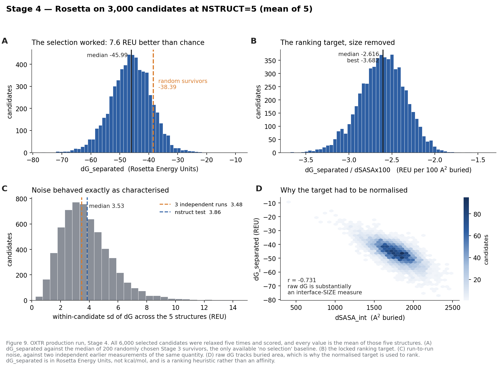
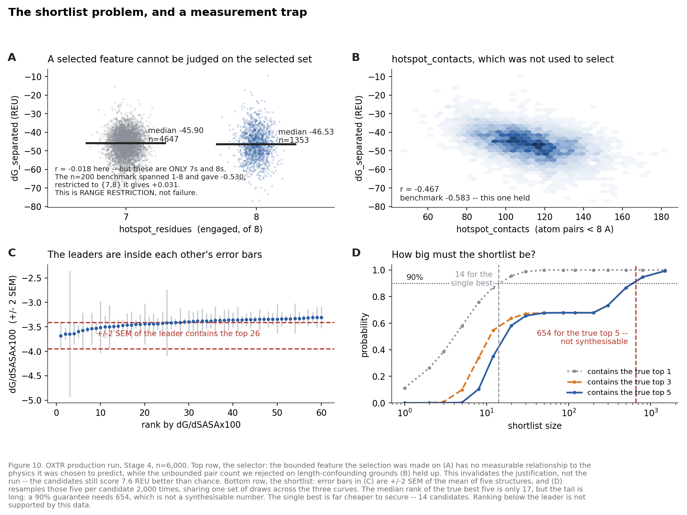
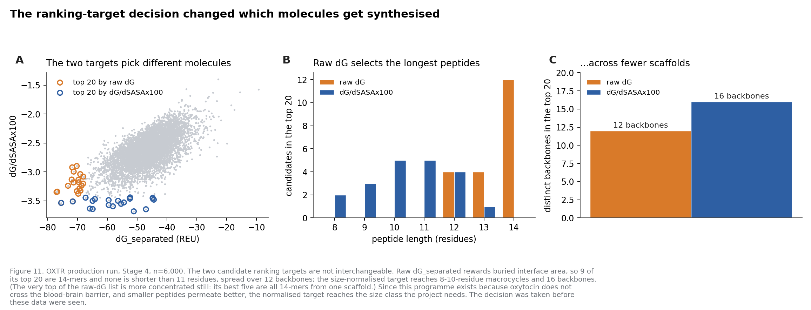
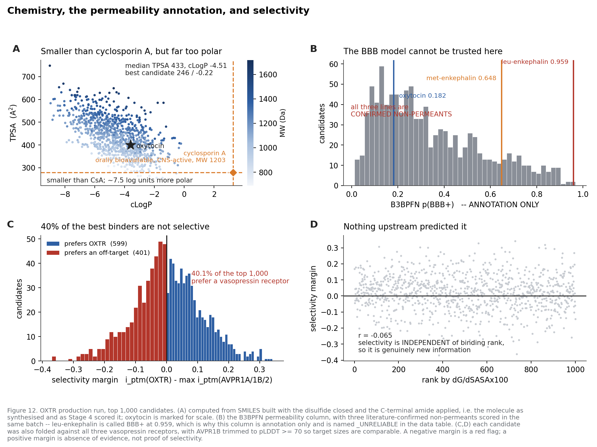
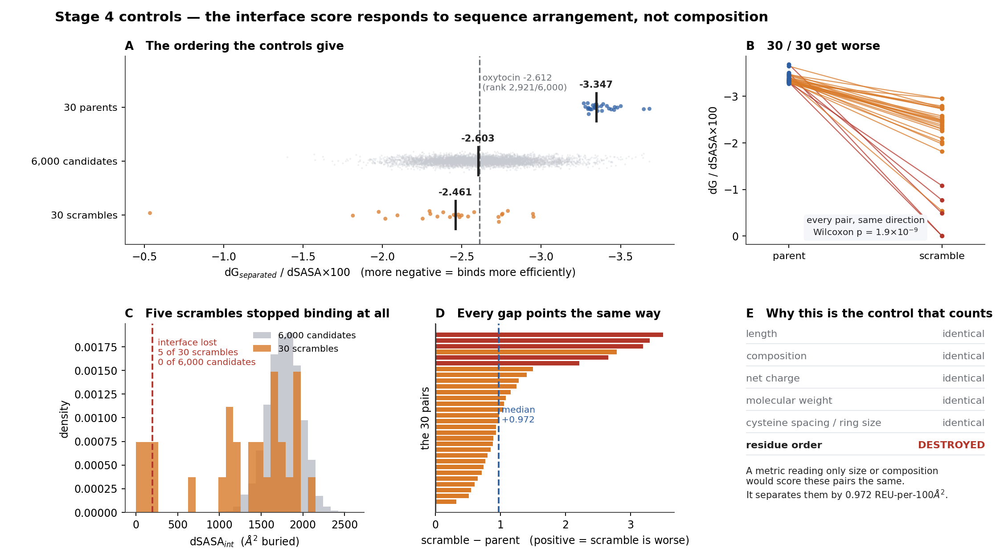
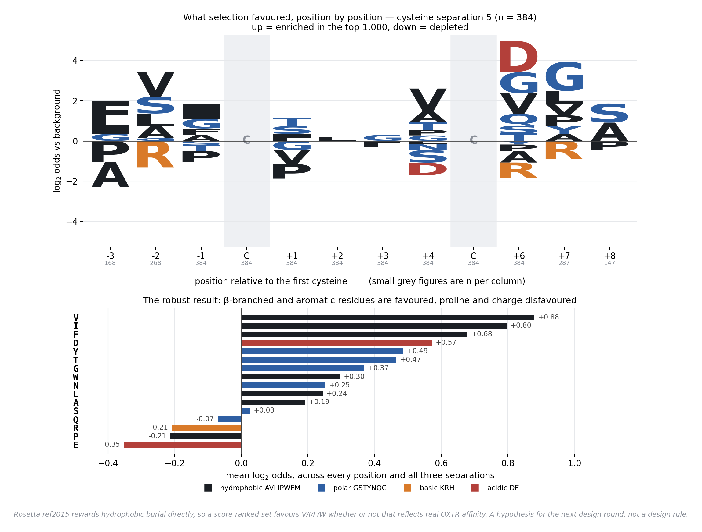
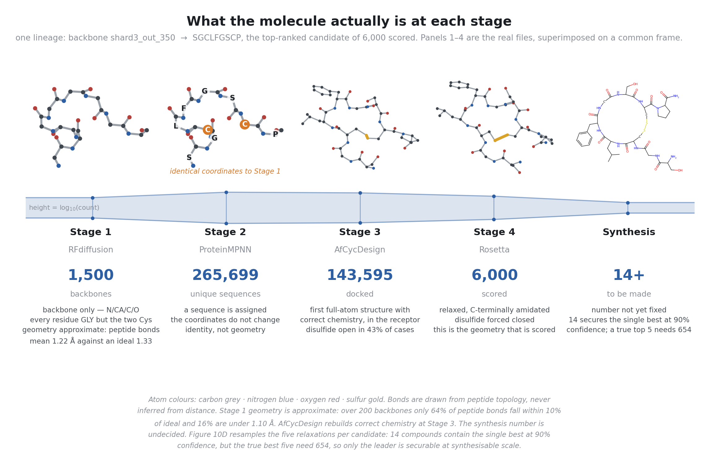

# Production Run v3 — Methods and Results

**Document version:** v1.10.1
**Last updated:** 2026-10-09
**Describes pipeline:** v3.9.0
**Run directory:** `/scratch/drewdog/denovo_binder_100_pilot_v2` (Woody)

The record of the **scale-up run** — the first execution of the pipeline at
production size, B = 1500 backbones, after the v3 parameter re-derivation.
Stages 1 and 2 ran on 2026-09-28/29 and produced a pool of 265,700 unique
candidate sequences.
This document reports what the run produced. It is separate from
[`METHODS_AND_RESULTS.md`](METHODS_AND_RESULTS.md), which remains the record of
the 100-backbone pilot and of the control experiments that justify each filter.

**How this fits with the other documents.** [`SUMMARY.md`](SUMMARY.md) is the
narrative. [`METHODS_AND_RESULTS.md`](METHODS_AND_RESULTS.md) is the pilot's
evidence and the controls. [`sampling_parameter_derivation.md`](sampling_parameter_derivation.md)
derives *why B = 1500, S = 600, T = 0.2*; this document reports *what those
values actually produced*. [`LIMITATIONS.md`](LIMITATIONS.md) catalogues what is
still weak. [`SOP.md`](SOP.md) is the runbook. [`CHANGELOG.md`](CHANGELOG.md)
holds superseded values.

> **Status: Stages 1-5 and 7 complete. 6,000 candidates scored; 267 survive
> everything measured.** Stage 1 finished 2026-09-29 08:07, Stage 2 at 11:25,
> Stage 3 scouting at 15:39, Stage 3 deepening at 04:04 on 2026-10-01. Stage 3
> total: 143,595 docked, 33.1 h wall, 132.8 GPU-h, zero failures, **87,338
> survivors** (q = 0.608). **Stage 4 batch 1** completed 2026-10-04 (3,000, 42.16 h,
> 2,344 core-h) and **batch 2** on 2026-10-07 (a disjoint 3,000) — both zero FAIL,
> all at `NSTRUCT=5` (§5c, §5e). **Stage 4 is calibrated**: 30 composition-matched
> scrambles all score worse than their parents (30/30, p = 1.9e-09) and five lose
> the interface entirely, against 0 of 6,000 candidates; oxytocin lands at the
> median of an unselected pool (§5d, Figure 14). **Stage 7 selectivity** has run
> over **all 481** efficiency passers (§5e). Stage 5 (BBB) is annotation only and
> demonstrably unusable for this class. Stage 6 (N-methylation) is written and not
> yet run; Stage 8 (shortlist) is the next decision.
>
> **The end-of-pipeline figure is 267** — candidates that bind efficiently
> (`dG/dSASAx100 < -3.0`) *and* show no preference for any vasopressin receptor.
> Two things that figure is not. Stage 4 **ranks and does not gate**, so the -3.0
> cut is a choice, not a derived threshold — the one number in the pipeline with
> nothing behind it. And a positive selectivity margin is **absence of evidence,
> not evidence of selectivity**, so 267 means "no off-target preference detected".
> The only true pass/fail step in the pipeline is the Stage 3 pocket gate.

---

## Reproducing the analysis

All numbers and figures in this document come from four committed CSVs under
`analysis/production_v3/`, regenerated by two scripts:

```bash
# Stage 1 -> stage1_backbones.csv, stage1_contact_frequency.csv
python scripts/viz/analyze_stage1_production.py

# Stage 2 -> stage2_per_backbone.csv, stage2_composition.csv
#            (safe to run mid-run; analyses only completed backbones)

# chemical space (section 3) -- reads unique_sequences.csv directly
python scripts/viz/plot_chemical_space.py
python scripts/viz/analyze_stage2_production.py

# figures -> docs/figures/prod_fig*.png
python scripts/viz/plot_production_run.py
```

Use `/scratch/drewdog/afcyc/env/bin/python` for the plotting script — the
`b3bpfn` env pins matplotlib 3.4 against numpy 2.2 and `tight_layout` fails
there.

---

# 1. Stage 1 — Backbone generation

### Method

RFdiffusion generates the peptide backbone in the presence of the receptor. It
is given a contig describing what to build, two motif residues copied from
oxytocin's own cysteines, and a set of hotspot residues naming the surface it
should aim at. It returns backbone coordinates only — N, CA, C, O — with every
designed residue as glycine. There is no sequence yet and no side chains; that
is Stage 2's job.

Each design is an independent sample from the diffusion model. Nothing in the
procedure optimises against OXTR's energetics, so the 1500 backbones are a
*search*, not 1500 attempts at one answer.

### Configuration

Script: [`scripts/stage1_backbones/OXTR_Stage1_ScaleUp.sh`](../scripts/stage1_backbones/OXTR_Stage1_ScaleUp.sh)

| parameter | value | why |
|---|---|---|
| `inference.num_designs` | 1500 | budget choice, not a derived optimum — `D_b` is not identifiable, so chemical space scales ~linearly with B. See the derivation document, Part III. |
| `contigmap.contigs` | `[1-3/L1-1/4-6/L6-6/1-3 O31-67/O69-236/O266-345/0]` | 1–3 residues, Cys, a 4–6 spacer, Cys, 1–3 residues — against three receptor segments |
| `ppi.hotspot_res` | O96, O295, O299, O38, O188, O34, O200, O316 | eight residues naming the target surface |
| `diffuser.T` | 50 | denoising steps |
| input | `7RYC.pdb` | the solved OXTR–oxytocin structure |

`L1-1` and `L6-6` are oxytocin's own Cys1 and Cys6, copied in as motif
residues. The 4–6 spacer between them is the one change from the pilot: it was
narrowed from 4–8 on 2026-09-24 so that every backbone lands at cysteine
separation 5–7, the regime where Rosetta's forced-disulfide energy was
favourable (Spearman ρ = +0.511, p = 0.007 on the pilot shortlist).

### Results

**Completed 2026-09-29 08:07:28**, having started 2026-09-28 23:14:46 —
**8 h 53 min** wall across 4 GPUs, **35.0 GPU-hours**, 84.1 s per design
(median 84.0, sd 1.3 s over all 1500). All 1500 designs were written and all
1500 parsed cleanly; none were skipped.


**Length.** The binder is 8–14 residues, and the distribution is not a choice —
it is what the contig's three variable segments produce when sampled
independently:

| length | 8 | 9 | 10 | 11 | 12 | 13 | 14 |
|---|---:|---:|---:|---:|---:|---:|---:|
| backbones | 60 | 165 | 359 | 359 | 306 | 184 | 67 |
| % | 4.0 | 11.0 | 23.9 | 23.9 | 20.4 | 12.3 | 4.5 |

The peak at 10–11 is the convolution of three uniform segments, not a
preference the model expressed. Oxytocin itself is 9.

**Cysteine separation.** Uniform across the three allowed values, as intended:
505 at separation 5, 490 at 6, 505 at 7. Oxytocin's native separation is 5.
Every backbone in the run is in the favourable regime; in the pilot, roughly
half were not.

**Disulfide geometry.** The measure that matters is the virtual Cβ–Cβ distance,
built from ideal geometry because RFdiffusion writes no side chains.

| measure | this run | reference |
|---|---|---|
| Cβ–Cβ median | 4.13 Å | survey 3.4–4.5 Å (mean 3.8) |
| Cβ–Cβ range | 3.56 – 5.00 Å | — |
| CA–CA median | 4.83 Å | survey 4.6–6.8 Å |
| 7RYC native Cβ–Cβ | — | 4.06 Å |
| within 3.0–5.0 Å | **1499 / 1500 (99.9%)** | — |
| within the tighter 3.4–4.5 Å survey range | 1486 / 1500 (99.1%) | — |

This is the constraint working exactly as specified. It is not a filter result
— nothing was discarded — it is confirmation that the motif constraint plus the
narrowed spacer put essentially the whole set into disulfide-compatible
geometry by construction.

**Compactness.** Radius of gyration runs 4.04–6.78 Å (mean 5.28) and rises
monotonically with length, as it must. Nothing is extended or unravelled.

**Confidence.** RFdiffusion's final-step pLDDT over the binder averages 0.966
(min 0.931); all 1500 exceed 0.9. This says the model is internally confident
about the geometry it drew. It says nothing about binding.


**Conformation.** Backbone dihedrals put roughly 35% of interior residues in
the helical region, 40% extended, 25% elsewhere, and this mix is stable across
lengths. There is no dominant fold — as expected for 8–14mers, where most
residues are turn or loop. Shape space is one broad continuum, not discrete
clusters.

### Results — where the backbones actually bind


Interfaces are small, as they must be for an 8–14mer: a median of 6 distinct
receptor residues within 5 Å (mean 6.5, range 1–16).

**Hotspot recovery is very uneven.** All eight hotspots were requested equally.
They were not used equally:

| hotspot | O188 | O295 | O34 | O96 | O299 | O316 | O38 | O200 |
|---|---:|---:|---:|---:|---:|---:|---:|---:|
| % of backbones contacting | 64.3 | 31.5 | 28.3 | 9.3 | 5.8 | 5.5 | 3.7 | 1.5 |

218 backbones (14.5%) contact **none** of the eight. Most reach one or two;
only 44 (2.9%) reach four or more.

Read on its own this looks like the hotspot specification being ignored. The
next section shows it is not — the run is on the correct epitope, and reaches
most of it through residues that were never named.

### Controls — did the run find the right site?

The hotspot list names eight residues. It does not say where the binder must
sit, and RFdiffusion is free to ignore it. The question that matters is not
whether the eight hotspots were used, but whether the run landed on the
epitope **native oxytocin itself occupies**. That is checkable directly from
7RYC, and it is the strongest positive result in the run.


Native oxytocin contacts **33 OXTR residues** within 5 Å (all heavy atoms, from
the 7RYC complex). The run recovers **29 of those 33 — 88%.** The four it never
reaches are O42, O46, O123 and O175, all peripheral.

The most-contacted residues in the run are overwhelmingly native contacts, and
mostly ones that were never named:

| receptor residue | % of 1500 backbones contacting | native contact? | requested hotspot? |
|---|---:|---|---|
| **O315** | **100.0** | **yes** | no |
| **O187** | **95.2** | **yes** | no |
| O306 | 64.5 | **yes** | no |
| O188 | 64.3 | **yes** | **yes** |
| O189 | 61.8 | **yes** | no |
| O295 | 31.5 | **yes** | **yes** |
| O34 | 28.3 | **yes** | **yes** |
| O33 | 26.9 | **yes** | no |
| O186 | 18.0 | no | no |
| O307 | 17.7 | no | no |
| O116 | 17.7 | **yes** | no |
| O35 | 15.3 | **yes** | no |

Ten of the twelve are native contacts. The two that are not — O186 and O307 —
sit immediately beside O187 and O306. Only three were requested.

Three things follow:

1. **The run rediscovered the oxytocin pocket without being told where it was.**
   The hotspot list was a *subset* of the native epitope, and every one of the
   eight requested residues is a genuine native contact. RFdiffusion took the
   eight as a regional prior and filled in the rest of the site, including the
   two residues that dominate the interface. This is the hotspot mechanism
   working as intended, not being ignored.
2. **Uneven hotspot usage is not a failure.** O200 is contacted by 1.5% of
   backbones and O188 by 64.3%, but both are native contacts. A hotspot is a
   hint about a surface, not a per-residue requirement, and 14.5% of backbones
   contacting none of the eight is unremarkable when 88% of the native epitope
   is being covered collectively.
3. **The 1500 backbones are not a survey of the receptor surface.** Only 58 of
   285 receptor residues are ever touched, and binder centroids all fall within
   a few ångström of each other — 95% lie within 1.8 Å of the mean. Every
   design is in essentially the same pocket. The diversity this run bought is
   diversity of *geometry within one site*, not of *site*.

Point 3 is the one to carry forward, and it is now a clean decision rather than
a worry. The site is the right one, so single-site convergence is a feature.
But it does mean B = 1500 bought no alternative-epitope coverage, and if an
allosteric or non-orthosteric site is ever wanted, it needs its own run with
its own hotspot list — scaling B will not produce it.

### Verdict

Stage 1 did what it was configured to do, and slightly more. The geometric
constraints are satisfied essentially perfectly (99.9% disulfide-compatible,
all in the favourable separation regime), the cost was as budgeted
(35.0 GPU-h against 34.5 predicted), and the output is 1500 backbones spanning 8–14 residues, all
placed in the native oxytocin pocket — 88% of oxytocin's own epitope recovered
from an eight-residue hint.

The run establishes nothing about binding: no scoring has happened yet, and
sitting in the right pocket is necessary, not sufficient. The one caveat is
that the set is narrow by site — it is 1500 variations on one epitope, which is
what was wanted here but should not be mistaken for surface coverage.

---

# 2. Stage 2 — Sequence design

### Method

ProteinMPNN reads a backbone and writes sequences that could fold into it. It
is run receptor-aware, so it sees the OXTR context, and the two motif cysteines
are pinned so the disulfide survives. Each backbone gets S = 600 draws at
sampling temperature T = 0.2; duplicates are then removed within each backbone
and globally.

### Configuration

Script: [`scripts/stage2_sequences/run_stage2_v3_scaleup.sh`](../scripts/stage2_sequences/run_stage2_v3_scaleup.sh)

| parameter | value | why |
|---|---|---|
| `--num_seq_per_target` | 600 | budget choice. Diversity is still accumulating at 600; see the rarefaction result below and the v3.3.4 CHANGELOG entry that withdrew the "94% of saturation" claim. |
| `--sampling_temp` | 0.2 | 2.14× the unique yield of T = 0.1, re-measured from raw data |
| `--fixed_positions_jsonl` | the two motif Cys | **hard gate.** Without it ProteinMPNN silently designs the cysteines away and exits 0 — the bug that produced the pilot's 1/400. |
| `--omit_AAs` | `CM` | stops extra cysteines and methionines creating a competing disulfide. Costs ~1% of unique output. |
| `--batch_size` | 50 | — |
| shards | 4 GPUs | — |

### Results

**Completed 2026-09-29 11:25**, having started at 09:27 — 1 h 58 min wall
across 4 GPUs. **900,000 draws** over all 1500 backbones, none skipped.


| measure | value |
|---|---|
| unique sequences per backbone | mean **178.8**, median 150 |
| range | **6 – 588** |
| standard deviation | 118.6 |
| sum of per-backbone uniques | 268,239 |
| cross-backbone duplicates | 2,539 (0.9%) |
| **global unique pool** | **265,700** |
| sequences with < 2 cysteines | **0** |
| backbones yielding ≤ 25 unique | 44 (2.9%) |
| backbones yielding ≤ 6 unique | 1 |

The pool size is confirmed independently: the pipeline's own
`unique_sequences.csv` holds 265,700 rows, matching this analysis exactly.

**The spread is the headline.** Given identical treatment — the same 600 draws
at the same temperature — one backbone yields 6 distinct sequences and another
yields 588, a **98-fold difference**. This is the heterogeneity that the v3.3.4
CHANGELOG entry identified as the reason no single coupon-collector `D`
describes the pool. It is a property of the backbones, not of the sampler, and
it means the pool is dominated by a productive minority: the median backbone
(150) sits well below the mean (178.8).

**The cysteine fix holds at scale.** Zero of the 265,700 unique sequences lost
the disulfide, across 900,000 draws. The hard gate works.

**One data-quality defect.** Exactly one draw contains an unassigned residue —
`shard1_out_288_u303`, `PCLGXSVPCR` — and it survives into the pool. One in
265,700 is negligible statistically, but `X` is not a synthesizable residue, so
**it should be dropped before Stage 3** rather than allowed to consume a
docking slot. It is the only such case; no other non-standard residue appears —
a full character inventory of the pool returns exactly the 18 designable amino
acids, plus C at the pinned positions, plus this single X.

**Cause and permanent fix.** This is not random corruption. ProteinMPNN's
alphabet is `ACDEFGHIKLMNPQRSTVWYX` — **21 tokens, with X at index 20**
(`protein_mpnn_run.py:64`), and `omit_AAs_np` masks only the characters passed
to `--omit_AAs` (line 67). We pass `CM`, so **X is left samplable** and at
T = 0.2 it fired once in 900,000 draws. The offending record carries
`score=2.1647` against a typical ~0.7, so it is a low-confidence outlier rather
than a systematic effect.

It passed every gate: `validate_cys.py` counts cysteines and this sequence has
two, so the batch was correctly reported clean. The fix is one character —
**`--omit_AAs CMX`** in `run_stage2_v3_scaleup.sh` — which makes the condition
impossible rather than relying on it being rare. A residue-alphabet assertion in
`validate_cys.py` would close the gap for any future sampler change; that one is
not applied.

> **Both resolved 2026-09-29.** `--omit_AAs CMX` is applied, and the sequence was
> removed from `unique_sequences.csv`, leaving **265,699** rows. The original is
> kept beside it as `unique_sequences.csv.with_X.orig`. A character inventory of
> the cleaned pool returns exactly `A C D E F G H I K L N P Q R S T V W Y` — the
> 18 designable residues plus the pinned cysteine, no M, no X. All figures and
> per-pool statistics in this document were computed **before** the removal and
> so quote 265,700; the difference is one sequence in 265,700.

**Rarefaction.** Diversity is still accumulating at S = 600 — it has not
saturated:

| draws per backbone | 25 | 50 | 100 | 200 | 300 | 450 | 600 |
|---|---:|---:|---:|---:|---:|---:|---:|
| mean unique | 17.4 | 30.1 | 50.8 | 83.9 | 111.4 | 147.3 | **178.8** |
| % of draws unique | 69.5 | 60.2 | 50.8 | 41.9 | 37.1 | 32.7 | **29.8** |
| marginal per 100 extra draws | — | +50.8 | +41.4 | +33.1 | +27.5 | +23.9 | **+21.0** |

At S = 600 fewer than 30% of draws are still novel, but the curve has not
flattened: another 100 draws per backbone would add ~21 unique sequences each,
about 31,000 across the run.

This reproduces the validation-shard prediction closely. That experiment
projected 192.3 unique per backbone and a marginal yield of +22.5 per 100 at
S = 600, against **178.8** and **+21.0** measured here — 7% and 7%
respectively. The derivation was sound, and S = 600 remains what the CHANGELOG
says it is: a budget choice that stops while diversity is still climbing, not a
saturation point.


**Composition is strongly non-uniform.** Against a uniform 5.6% over the 18
residues ProteinMPNN was allowed:

| residue | P | G | L | S | R | A | V | F | T | D | E | Y | I | N | W | Q | H | K |
|---|---:|---:|---:|---:|---:|---:|---:|---:|---:|---:|---:|---:|---:|---:|---:|---:|---:|---:|
| % of designed positions | 15.8 | 15.2 | 14.5 | 9.5 | 8.8 | 7.9 | 5.0 | 4.4 | 3.9 | 3.4 | 3.1 | 2.3 | 2.1 | 1.5 | 1.1 | 0.8 | 0.4 | 0.2 |

Proline and glycine together take **31%** of all designed positions — a
turn-rich signature, which is what a macrocycle this small should look like.
Adding leucine, the top three cover 45.5%.

Two points worth carrying to later stages. **Arginine is heavily used (8.8%)
while lysine is almost absent (0.2%)** — a 44-fold preference between two
residues of the same charge, which is ProteinMPNN reading the receptor
environment rather than a composition prior. And the overall profile is
hydrophobic-and-basic, with acidic residues (D + E = 6.5%) well below the
basics (R + K + H = 9.4%). Both bear on the Stage 5a permeability gate, which
has not run yet, and on synthesis: a 31% Pro/Gly content is a difficult-sequence
signal for SPPS.


**Yield rises with length**, as sequence space must:

| length | 8 | 9 | 10 | 11 | 12 | 13 | 14 |
|---|---:|---:|---:|---:|---:|---:|---:|
| backbones | 60 | 165 | 359 | 359 | 306 | 184 | 67 |
| mean unique | 88.4 | 113.2 | 143.3 | 173.6 | 210.8 | 249.3 | 300.0 |
| median unique | 68.5 | 97 | 121 | 149 | 190 | 232 | 312 |
| range | 6–364 | 8–447 | 10–512 | 20–554 | 11–567 | 16–568 | 69–588 |
| contribution to pool | 5,304 | 18,678 | 51,445 | 62,322 | 64,505 | 45,871 | 20,100 |

Mean yield rises monotonically and more than triples from 8 to 14 residues.
Spearman ρ(length, unique) = **+0.424**.

But the effect is far from deterministic: length explains only part of a
98-fold spread, and **within a single length class the range is still 30- to
50-fold** — 10mers run from 10 to 512. Cysteine separation is a weaker
correlate (ρ = +0.248), as is radius of gyration (ρ = +0.292). Whatever makes a
backbone productive is mostly not captured by any of these three descriptors.

Because mid-length classes are both common and productive, **10–12mers supply
66% of the pool** (178,272 of 268,239) despite being 68% of the backbones. The
8mers, at 4% of backbones, supply 2%.

**Final pool: 265,700 unique sequences.** This is the number that sets Stage 3's
cost — at the pilot's measured 5.6 s per docking run, the full pool would be
about 413 GPU-hours, which is why Stage 3 is scouted rather than run
exhaustively.

### Verdict

Stage 2 did what it was designed to do and what was predicted of it. The
cysteine constraint held across 900,000 draws with zero failures, the diversity
yield came within 7% of the validation-shard projection, the pool size matches
the pipeline's own count exactly, and the composition is chemically sensible
for a small macrocycle.

The 98-fold spread in per-backbone yield is the most consequential property.
The pool is dominated by a productive minority, and length predicts only part
of it (ρ = +0.424, with 30-to-50-fold variation inside each length class). Any
Stage 3 allocation that assumes a uniform contribution per backbone will
misspend its budget; allocation should follow realised pool size, which is now
known exactly for all 1500.

One cleanup item: drop the single `X`-containing sequence before Stage 3.

---

# 3. Chemical space explored

### Method

Measured directly on `unique_sequences.csv` (265,700 sequences). Sequences are
grouped into **scaffold classes** — a class is one (length, cysteine-position)
pair. This grouping is necessary: the contig `1-3/C/4-6/C/1-3` permits several
cysteine placements within a single length, so per-position statistics pooled by
length alone mix non-homologous positions and understate the pins. Entropy is
Shannon entropy per position in bits; the ceiling is log2(18) = 4.17 bits, since
C and M are omitted from the design pool.

### Results


*Panel A — sampling against the accessible space, log scale; labels give the
fraction covered. Panel B — per-position Shannon entropy inside the **largest
single scaffold class only** (length 14, Cys at 4 and 11, n = 20,095 — **7.6% of
the pool**); the two orange bars are the pinned cysteines at exactly 0.00 bits.
Per-position entropy is only well defined within one such class, and cysteine
placement is uniform at **lengths 8 and 14 only**, so this panel is not
representative of the pool's other five length bands — see below. Panel C — the occupied region of charge/hydrophobicity space, all 265,700
sequences, log density. Panel D — exact sequences against distinct
physicochemical patterns, per length. Regenerate with
`python scripts/viz/plot_chemical_space.py`.*

**27 distinct scaffold classes.** The six largest:

| length | Cys at | unique | theoretical space | coverage |
|---:|---|---:|---:|---:|
| 14 | 3, 10 | 20,095 | 1.16 × 10¹⁵ | 1.7 × 10⁻¹¹ |
| 13 | 2, 9 | 16,914 | 6.43 × 10¹³ | 2.6 × 10⁻¹⁰ |
| 13 | 3, 10 | 15,569 | 6.43 × 10¹³ | 2.4 × 10⁻¹⁰ |
| 13 | 3, 9 | 13,387 | 6.43 × 10¹³ | 2.1 × 10⁻¹⁰ |
| 12 | 2, 8 | 12,641 | 3.57 × 10¹² | 3.5 × 10⁻⁹ |
| 12 | 2, 9 | 11,181 | 3.57 × 10¹² | 3.1 × 10⁻⁹ |

**Coverage of the accessible sequence space is between 10⁻⁴ and 10⁻¹¹**,
falling with length. Even the smallest scaffold (length 8, six designable
positions, 3.4 × 10⁷ possibilities) is sampled at 1.4 × 10⁻⁴. This is not a
criticism of the run — exhaustive coverage is impossible and unnecessary — but
it does mean **the pool is a sparse sample, not a survey.** Any statement of the
form "the best binder in this chemical space" is unsupportable; the defensible
claim is "the best binder among 265,700 sampled points."

**Positional diversity is high and the pins are exact.** Largest class
(length 14, Cys at **4 and 11**, 1-indexed, n = 20,095), entropy per position in
bits:

```
3.17  3.67  2.95  0.00  3.24  3.00  3.12  3.69  3.60  3.61  0.00  2.90  3.07  2.89
                   ^Cys                                    ^Cys
```

Designable positions average **3.24 of 4.17 bits — 78% of the maximum**, so
ProteinMPNN is not collapsing onto a consensus; it is sampling broadly at every
free position. The two cysteine positions measure **exactly 0.00 bits** across
all 20,095 sequences, which is independent confirmation that the fixed-position
mechanism held for every draw.

**Read this panel narrowly — it covers 7.6% of the pool, and it is the most
favourable slice.** Cysteine placement is uniform only at the two extreme
lengths; the five bands in between carry several pin positions at once:

| length | n | commonest Cys positions |
|---|---:|---|
| 8 | 4,909 | (2,7) **100%** |
| 9 | 17,973 | (3,8) 45%, (2,8) 28%, (2,7) 27% |
| 10 | 50,339 | (2,8) 20%, (2,7) 19%, (4,9) 17% |
| 11 | 62,097 | (2,8) 17%, (4,10) 16%, (2,9) 14% |
| 12 | 64,416 | (3,9) 20%, (3,10) 17%, (4,9) 17% |
| 13 | 45,870 | (3,10) 37%, (4,11) 34%, (4,10) 29% |
| 14 | 20,095 | (4,11) **100%** |

The three largest bands — 10, 11 and 12, which together are 66% of the pool —
have no dominant pin position at all. The 0.00-bit result therefore says the
pinning mechanism works *within a scaffold class*; it is not a statement that
the whole run shares one cysteine geometry. The 27 scaffold classes exist
precisely because it does not.

**Physicochemical envelope** (all 265,700):

| property | min | p5 | median | p95 | max | mean |
|---|---:|---:|---:|---:|---:|---:|
| net charge | −4 | −1 | 0 | +2 | +5 | +0.28 |
| GRAVY (Kyte–Doolittle) | −2.08 | −0.55 | +0.39 | +1.39 | +2.91 | +0.40 |
| aromatic fraction | 0.00 | 0.00 | 0.08 | 0.20 | 0.45 | 0.06 |
| Pro fraction | 0.00 | 0.00 | 0.10 | 0.30 | 0.58 | 0.13 |
| Gly fraction | 0.00 | 0.00 | 0.10 | 0.27 | 0.62 | 0.12 |

The pool is **near-neutral and mildly hydrophobic**, centred on charge 0 and
GRAVY +0.39, with real spread in both (charge −4 to +5). Proline and glycine
each average 12–13%, consistent with a constrained macrocycle.

**How much of the diversity is more than conservative substitution?**
Collapsing the alphabet to eight physicochemical classes — h(AVLIP), a(FWY),
p(STNQ), +(KRH), −(DE), g(G), C, m(M):

| | count |
|---|---:|
| unique exact sequences | 265,700 |
| unique physicochemical patterns | **110,845 (41.7%)** |
| exact sequences per pattern | 2.40 |

So roughly **111,000 chemically distinct designs**, each represented on average
2.4 times by conservative substitution. That is the number to quote when asking
how many genuinely different molecules were explored — it is the more honest
denominator than 265,700, and it is still large.

### Verdict

The space explored is **broad in sequence and narrow in site**. Positional
entropy at 78% of maximum and ~111,000 distinct physicochemical patterns show
the sampler is doing its job. But this compounds the epitope finding in §1: 1500
backbones on one epitope, each sampled sparsely but widely. The run explores
*chemistry* thoroughly and *binding-site geography* not at all.

---

# 4. Stage 3 allocation — scout depth k

### Method

Scout depth `k` sets how many sequences per backbone are docked before
backbones are ranked by mean i_ptm and the top 50% deepened. Its cost is
computed from the realised pool (`unique_sequences.csv`, post-global-dedup,
which is what `select_scouts.py` reads) at the measured 5.6 s/candidate.
Reliability of the backbone mean is Spearman–Brown, `k·ICC / (1 + (k−1)·ICC)`,
at the **measured ICC = 0.358** — not the pilot's 0.562, on which the original
choice of k = 6 was made.

### Results

| k | thin bbs | scouts | deepen | total dockings | GPU-h | wall, 4 GPUs | reliability |
|---:|---:|---:|---:|---:|---:|---:|---:|
| 4 | 0 | 6,000 | 129,850 | 135,850 | 211.3 | 52.8 h | 0.690 |
| **6** | 2 | 9,000 | 128,350 | **137,350** | **213.7** | 53.4 h | **0.770** |
| 8 | 3 | 11,995 | 126,852 | 138,847 | 216.0 | 54.0 h | 0.817 |
| **10** | 8 | 14,987 | 125,356 | **140,343** | **218.3** | 54.6 h | **0.848** |
| 12 | 11 | 17,968 | 123,866 | 141,834 | 220.6 | 55.2 h | 0.870 |
| 14 | 14 | 20,944 | 122,378 | 143,322 | 222.9 | 55.7 h | 0.886 |

**Extra scouting is close to half price.** Raising k from 6 to 10 adds 5,987
scout dockings but *removes* 2,994 deepening dockings, because a scouted
sequence is not re-docked when its backbone is deepened. Net cost:

```
total dockings  137,350 -> 140,343   (+2,993, +2.2%)
GPU-hours         213.7 -> 218.3     (+4.7 GPU-h = +1.2 h wall on 4 GPUs)
reliability       0.770 -> 0.848
```

**The originally planned reliability is recoverable.** k = 6 was chosen when
ICC was believed to be 0.562, where it yields 0.885. At the measured ICC = 0.358
it yields only **0.770**. Restoring 0.885 requires **k ≈ 14**, costing +5,972
dockings over k = 6 (+4.3%, +9.2 GPU-h, +2.3 h wall).

Model-based recovery of the true top-half of backbones (bivariate normal,
correlation between observed and true backbone mean = √reliability):

| k | 6 | 10 | 14 |
|---|---:|---:|---:|
| top-50% recovery | 84.1% | 87.2% | 89.1% |

This metric is **not** the 99.2% quoted in `sampling_parameter_derivation.md`
§17, which used a different definition and the pilot's higher ICC. It is stated
here as a model, not a measurement: no i_ptm has been measured on this pool.

**Thin backbones are not a constraint.** Only 2 backbones have a pool ≤ 6 and
only 8 have ≤ 10, so raising k strands almost nothing.

### Verdict

**k = 10 is the recommended value** on these numbers: +2.2% dockings for
+0.078 reliability, and the ICC on which k = 6 was justified has since been
measured 36% lower than assumed. k = 14 fully restores the planned reliability
for +4.3%. Deciding to stay at k = 6 is defensible only if Stage 3 wall clock is
the binding constraint, which at 53.4 h versus 54.6 h it is not.

> **This supersedes the Stage 3 projection in `CHANGELOG.md` v3.3.3**, which
> carried 151,275 dockings and ~235 GPU-h from the pre-run pool estimate of
> ~289,000. The realised pool is 265,700, so Stage 3 at k = 6 is
> **137,350 dockings / 213.7 GPU-h**, about 9% cheaper than documented.

---

# 5. Stage 3 — Scout docking

### Method

AfCycDesign (`run_afcyc_v3_shard.py`), 4 GPUs, candidates grouped by peptide
length so the model is built once per group. Scouts selected by
`select_scouts.py` at **k = 10, seed 1234** — raised from 6 in v3.3.4 because ICC
had been measured well below the value k=6 was chosen on. Free acid: AfCycDesign
takes a bare amino-acid string and cannot represent a C-terminal cap.

### Results

**Completed 2026-09-29 15:39:32**, having started 12:09:48 — **3.50 h wall**
across 4 GPUs, **14.1 GPU-h**, **3.38 s/candidate** per GPU (range 2.94–3.67
across 7 length groups × 4 shards). **14,987 / 14,987** docked and scored, **zero
failures**.

| measure | projected | measured |
|---|---:|---:|
| throughput | 5.6 s/candidate | **3.38** |
| cost | 23.3 GPU-h | **14.1** |
| wall clock | 5.8 h | **3.50 h** |

1.66× faster than budgeted: production length groups hold ~2,100 candidates
against the validation shard's 14–32, so the per-group model build amortises.

**Scout selection was unbiased.** `select_scouts.py`'s bias check returned mean
normalised score-rank **0.500** (n = 14,920 ranks, tolerance ±0.100) — the scouts
are a random sample of each backbone's pool, not the best-scoring members, which
the backbone-mean estimand requires.

### The gate — q = 0.494

| criterion | count | rate | role |
|---|---:|---:|---|
| touches receptor anywhere | 7,523 / 14,987 | 50.2% | diagnostic |
| disulfide drawn closed (≤4 Å) | 7,487 / 14,987 | 50.0% | diagnostic only |
| **at the hotspots (≥1 within 8 Å)** | **7,408 / 14,987** | **49.4%** | **GATED** |

**q = 0.494**, against 0.465 projected from 600 validation scouts — 6% better, on
25× the sample. The disulfide diagnostic reproduces its artefact character (50.0%
closed against the validation shard's 52.2%), re-confirming the v3.3.0 decision
to demote it from a gate.

### ICC = 0.331 — the pre-registered check passes

`sampling_parameter_derivation.md` §17 requires ICC be re-estimated on the first
completed scale-up shard before committing to deepening. On all 1,500 backbones
with 10 scouts each:

| | ICC | reliability at k=6 | at k=10 | at k=14 |
|---|---:|---:|---:|---:|
| pilot (S=4) | 0.562 | 0.885 | — | — |
| validation shard (S=600) | 0.358 | 0.770 | 0.848 | 0.886 |
| **production (n=1,500)** | **0.331** | 0.748 | **0.832** | 0.874 |

**k = 10 delivers reliability 0.832.** k = 6 would have given 0.748, so the v3.3.4
decision to raise it was correct.

ICC rose monotonically as longer peptides entered the scored set — 0.224 (length 8
only) → 0.245 → 0.280 → 0.300 → **0.331** (all lengths). The early sub-0.30
readings were an artefact of the first and shortest length group, and the i_ptm
distribution shifted with it (median 0.170 → 0.216; fraction ≥0.30 rising 18.3% →
42.8%). Longer peptides make more receptor contacts and score higher, and that
length-driven spread is between-backbone variance.

### Backbone ranking and the deepening set

| percentile | mean i_ptm | backbone |
|---|---:|---|
| best | 0.662 | shard2_out_77 |
| p10 | 0.404 | — |
| p25 | 0.338 | — |
| **median (the f=0.50 cut)** | **0.264** | shard2_out_149 |
| p75 | 0.199 | — |
| worst | 0.119 | shard0_out_257 |

mean 0.273, sd 0.091.

Deepening selects by **MAX i_ptm, not mean** — see `select_deepening.py` and
CHANGELOG v3.3.5 for the split-half evidence. At f = 0.50 that is **747
backbones** (3 of the 750 kept have nothing left to deepen) and **128,608
candidates**, cut at max i_ptm 0.4589, best 0.7722.

Disk: 2.8 GB. `stage3_gate.csv` holds all 14,987 with `ss_dist`,
`contact_pairs`, `hotspot_contacts`, `centroid_dist`.

### Verdict

Scouting did what it was designed to do and cost 60% of budget. q came in above
projection and the pre-registered ICC check passes, so the scout-and-deepen
allocation is justified on measured production data rather than pilot
extrapolation. Nothing here speaks to binding — i_ptm is a predicted-alignment
confidence, not an energy.

---

# 5b. Stage 3 — Deepening docking

Launched 2026-09-29 22:27, completed **2026-10-01 04:04:15**. The 747 backbones
selected at f = 0.50 by MAX i_ptm (§5), all remaining sequences on each.

| | |
|---|---:|
| candidates docked and scored | **128,608 / 128,608** |
| failures | **0** |
| per shard | 32,152 x 4, exact |
| wall clock | **29.62 h** on 4 GPUs (1738.3 / 1765.7 / 1750.5 / 1777.0 min) |
| cost | **118.7 GPU-h** |
| throughput | 3.24-3.32 s per candidate per GPU |
| disk | 24 GB |

Shard spread is 2.2% end-to-end, so the sequence-count sharding balanced the
work as intended; no shard needed a restart.

The projection going in was 120.7 GPU-h. Realised 118.7 — **within 2%**, which
is the first time a Stage 3 cost estimate in this project has been made from
measured production throughput rather than pilot extrapolation.

### Gate

```
centroid dist to native pose     : median 5.22  min 0.07  max 69.04
touches receptor anywhere        :  81136 / 128608  (63.1%)   diagnostic
disulfide drawn closed (<= 4.0 A):  78659 / 128608  (61.2%)   diagnostic only
AT THE HOTSPOTS (>= 1 within 8 A):  79930 / 128608  (62.2%)   GATED
pass rate q                      : 0.622
```

**q = 0.622, against scouting's 0.494.** The gap is the deepening selector
working, not a drift in the gate: deepening ran only on the top half of
backbones by max i_ptm, so a higher hotspot-engagement rate is the expected
signature. i_ptm moved with it — median 0.216 -> **0.341**, fraction >= 0.30
42.8% -> **56.2%**.

### The length confound persists, and widens

| length | n | median i_ptm | >= 0.30 |
|---:|---:|---:|---:|
| 8 | 1,340 | 0.177 | 27.7% |
| 9 | 6,387 | 0.183 | 37.2% |
| 10 | 21,171 | 0.207 | 43.4% |
| 11 | 34,157 | 0.339 | 55.7% |
| 12 | 32,465 | 0.359 | 59.8% |
| 13 | 23,373 | 0.369 | 65.2% |
| 14 | 9,715 | 0.379 | 68.5% |

A 14-mer's median i_ptm is **2.1x** an 8-mer's. This is the same monotonic
length effect seen in scouting's ICC decomposition (§5) and it is not evidence
that long peptides bind better — more residues make more contacts, and i_ptm is
a contact-supported confidence. Any selection that ranks the combined pool on
raw i_ptm will therefore select for length. See `LIMITATIONS.md` O0.

### Backbone identity matters more than the pool average suggests

Over the 747 deepened backbones, per-backbone q spans the full range:

```
median 0.645    p10 0.256    p90 0.937    min 0.000    max 1.000
survivors per backbone: median 81, min 0, max 448
3 backbones produced zero survivors from a full deepening set
```

A backbone that passed the f = 0.50 cut on its single best scout can still fail
every one of its remaining sequences. That is an argument for stratifying any
Stage 4 cap by backbone rather than taking a flat top-N off the global i_ptm
ranking, which concentrates hard: the **top 500 survivors come from just 123 of
the 747 backbones**, the top 1,000 from 188, the top 5,000 from 479.

### Stage 3 combined

| | scouting | deepening | **combined** |
|---|---:|---:|---:|
| candidates | 14,987 | 128,608 | **143,595** |
| wall clock | 3.50 h | 29.62 h | **33.1 h** |
| cost | 14.1 GPU-h | 118.7 GPU-h | **132.8 GPU-h** |
| q | 0.494 | 0.622 | **0.608** |
| survivors | 7,408 | 79,930 | **87,338** |

**132.8 GPU-h against the 235 GPU-h carried in `CHANGELOG.md` v3.3.3 — 43%
under**, and 38% under the 213.7 GPU-h re-derived in §4 from the realised pool.
The scout-and-deepen allocation is now validated on its own completed run.

Best candidates in the combined pool:

| sequence_id | i_ptm | len | sequence |
|---|---:|---:|---|
| shard0_out_276_u334 | 0.834 | 12 | GACLLSWYLCVV |
| shard0_out_276_u318 | 0.811 | 12 | GSCLLSYALCVV |
| shard0_out_136_u222 | 0.810 | 10 | GCFSYHECRR |
| shard3_out_349_u525 | 0.809 | 12 | APICLAGSCVAY |
| shard1_out_250_u209 | 0.794 | 12 | GICASYHECRRA |

Two sequence families dominate the top of the list — a `C[LI]..S[YW]..C` 12-mer
motif and a `CFSY[HY]EC-RR` 10-mer motif — and they recur across different
backbones. Convergent motifs are encouraging as a signal but a liability as a
synthesis list; **diversity has to be an explicit constraint on the Stage 4
shortlist**, not something the i_ptm ranking will supply.

### What this costs at Stage 4

87,338 survivors at the measured 1,245 s per candidate on 64 cores is
**19.7 days**. At q = 0.494 the same arithmetic gave 15.7 days; the better
deepening pass rate made the Rosetta problem worse, not better. Stage 4
**cannot run uncapped** and the cap is now the critical-path decision — see
`LIMITATIONS.md` O0/O0b and the open items in §6.

---

# 5c. Stage 4 — Rosetta, complete

Launched **2026-10-02 14:03:05**, completed **2026-10-04 08:12:57**.
**42.16 h wall, 2,344 core-hours, 56 of 64 cores at 99% efficiency, 13 GB.**
`STATUS: COMPLETE` — 3000/3000 results, zero FAIL, every one with `nstruct_scored == 5`.
Full figures in [`analysis/stage4_production/stage4_results.md`](../analysis/stage4_production/stage4_results.md).
Parameters and their derivation are in
[`stage4_selection_derivation.md`](stage4_selection_derivation.md) §6.

| parameter | value |
|---|---|
| candidates | **3,000** of 87,338 survivors (3.4%) |
| distinct backbones | **578** |
| per-backbone quota | 10 within each length band |
| selector feature | `hotspot_residues` (bounded 0–8) |
| length allocation | designed-pool shape: 56/203/568/701/727/518/227 for lengths 8–14 |
| `NSTRUCT` | **5**, reported as the MEAN of 5 |
| ranking target | `dG_separated/dSASAx100`, raw `dG_separated` carried |
| mean i_ptm of the selection | 0.535 (survivor pool 0.416) |
| pose provenance | **2,741 deepening + 259 scouts** — both v3 |

### Pre-flight, all 3,000 candidates

Every check passed with zero problems:

| check | result |
|---|---|
| pose found in exactly one Stage 3 directory | 3,000/3,000 |
| chains A and B both present | 3,000/3,000 |
| chain B shorter than A (the `-interface A_B` assumption) | 3,000/3,000 |
| exactly 2 CYS in chain B | 3,000/3,000 |
| chain B residue count == sequence length | 3,000/3,000 |
| PDB cysteine numbering cross-checked against sequence indices | 3,000/3,000 |

**The split input directories were the principal bad-data risk.** 2,741 candidates
live in `stage_3_deepening/afcyc_out` and 259 in `stage_3_docking/afcyc_out`;
`run_stage4_validation.sh` sets one `INPUT_DIR` for every candidate and would have
silently failed one group while the other succeeded, exiting 0 with a partial pool.
`run_stage4_production.sh` resolves the directory per candidate from a fourth
column in `jobs.tsv`, refuses to start without it, and checks each pose exists
before calling the worker.

### Verified live on the first candidates

- **C-terminal amidation**: terminal residue charge **−1.000 → −0.020 e**
- **Forced disulfide**: `disulf.txt` in pose numbering (`289 295` from PDB `4B-10B`);
  one in-flight candidate entered at SG-SG **3.19 Å**, open — the 42% case the
  forcing exists for
- both input directories processing
- zero FATAL, zero FAILED

### Results

| quantity | median | p5 | p95 | best |
|---|---:|---:|---:|---:|
| `dG_separated` (REU) | **−45.99** | −58.15 | −35.36 | **−77.01** |
| `dG_separated/dSASAx100` | **−2.616** | −3.108 | −2.190 | **−3.682** |

Within-candidate sd on dG: median **3.53**, matching the replicate study's 3.48 and the
`nstruct` test's 3.86. **The selection worked** — median dG −45.99 against −38.39 for a
random sample of survivors, 7.6 REU better.

Top candidates on the locked target are **8–9-mers** (`SGCLFGSCP` −3.682,
`GCLFGPCT` −3.646), spanning 9 backbones in the top 12 and 36 in the top 50. Ranked on
**raw dG** instead, the leaders are all 14-mers from one backbone — so the
`dG/dSASAx100` decision changed which size class gets synthesised, in favour of the
BBB-relevant one.

### Figures



**Figure 9 — what Stage 4 produced, and the noise on it.** Every value is the mean
of five independent FastRelax trajectories. Panel A sets the result against the
only available no-selection baseline: 200 randomly chosen Stage 3 survivors, median
−38.39. Panel C is the check that matters for trusting the rest — run-to-run noise
came in at median **3.53 REU**, against 3.48 measured on three independent runs and
3.86 on the `nstruct` test, so the noise model held in production. Panel D is why
the ranking target is normalised: **r = −0.711** between `dSASA_int` and raw dG on
these 3,000 (the n=200 estimate was −0.766), so raw dG is substantially an
interface-size measure.



**Figure 10 — the two findings that overturned earlier conclusions.**
*Recomputed on the full 6,000 at v5.4.0; the numbers below replace the batch-1
values.* Panel A: `hotspot_residues`, the feature the candidates were *selected*
on, has **r = −0.018** against the physics, versus the −0.530 measured at n = 200.
The group medians differ by 0.63 REU against noise of 3.53. Panel B shows the
feature rejected on length-confounding grounds held up at **−0.467**. Panels C and
D quantify the shortlist: **26 candidates** lie within ±2 SEM of the leader, and
the containment curve is far worse than batch 1 suggested — the median rank of
the true best five is 17, but a 90% guarantee needs **654**. The single best needs
only **14**. See §*A top-5 is not identifiable* below.



**Figure 11 — the ranking-target decision changed which molecules win.** Nine of
the top 20 by raw dG are 14-mers and none is shorter than 11 residues; the
normalised target reaches 8–10-residue macrocycles across 16 backbones rather than
12. Since the programme exists because oxytocin does not cross the blood-brain
barrier, and smaller peptides permeate better, the normalised target reaches the
size class the project needs. **The decision was taken before these data existed.**



**Figure 12 — chemistry, permeability annotation, and selectivity.** Panel A is
computed from SMILES built with the disulfide closed and the C-terminal amide
applied, so it describes the molecule as synthesised and as Stage 4 scored it:
**median TPSA 433 Ų, cLogP −4.51**, with the best candidate at 246 / −0.22. The
reference line is **cyclosporin A at TPSA 279 / cLogP +3.27** — an orally
bioavailable, CNS-active macrocycle of comparable mass — not a small-molecule
Lipinski threshold, which does not apply to this class. Against CsA the series is
*smaller* but far more polar. Panel B is the permeability column
with its controls in the same batch — **leu-enkephalin, a literature-confirmed
non-permeant, scores 0.959 BBB+** — which is why that column is annotation only and
named `_UNRELIABLE`. Panels C and D are Stage 7 **as it stood at the top-1,000
slice**: 401 of 1,000 (40.1%) prefer a vasopressin receptor. Coverage has since
been reconciled at **3,209 compounds**, where the figure is **48.1%** and
r = −0.134 — see §5e. Selectivity remains essentially independent of binding
rank, so it is information nothing upstream supplied.

### A top-5 is not identifiable from this data

Measured on the **full 6,000** (2,000 bootstrap draws over the five per-structure
`dG/dSASAx100` values, one set of draws shared across all three targets so the
numbers are monotone in *k*):

| true set | median rank | shortlist needed for 90% containment |
|---|---:|---:|
| top-1 | 5 | **14** |
| top-3 | 11 | 654 |
| **top-5** | **17** | **654** |

The batch-1 figures (8 / 24 / 86) were measured on half this pool and are
superseded. Doubling the pool does not double the shortlist: it fills the region
just below the leader, so the *tail* of the rank distribution explodes while the
median barely moves. The three targets share a p90 of 654 because a single
candidate in the true top 3 is unstable enough to land around that rank on a
re-run; it alone sets the bound.

SEM of the mean-of-5 is **0.0837** (median within-candidate sd 0.1872) and the
rank-1-to-rank-5 gap is only **0.65 SEM**; measured directly, **26 candidates lie
within ±2 SEM of the leader** (Figure 10C). More `nstruct` cannot fix this —
halving the SEM costs 4× the trajectories.

**What this means for synthesis.** A true top 5 is not purchasable: 654 compounds
is not a synthesis campaign. The *single* best is cheap to secure at 14. So the
synthesis set should guarantee the leader and otherwise be chosen on diversity,
not on rank — the ordering below rank 1 is not supported by this data.

### Measuring the selector on the selected set does not work

| feature | r vs dG (n=3000) | n=200 benchmark |
|---|---:|---:|
| `hotspot_contacts` | −0.487 | −0.583 |
| *length* | *−0.459* | |
| `i_ptm` | −0.190 | −0.477 |
| `hotspot_residues` | −0.005 | −0.530 |

These were initially read as the selector failing to replicate. **That reading was
wrong.** The 3,000 contain only `hotspot_residues` 7 and 8, because that is what the
selection picked; restricting the n=200 benchmark to the same {7,8} range gives
**+0.031**, matching the −0.005 measured here. The feature behaves identically in
both datasets and **it worked** — the 3,000 score 7.6 REU better than a random
sample of survivors because of it.

The same caution applies to `i_ptm` and `centroid_dist` above: all were used in
selection or stratification, so their apparent weakening here is at least partly
range restriction rather than genuine drift. `LIMITATIONS.md` O0f records the error
and the general lesson — **a feature used to select a set cannot be validated on
that set.**

### Completion criterion

`STATUS: COMPLETE` requires all 3,000 candidates to have a results JSON with
`nstruct_scored == 5` and zero FAIL lines. Anything else prints
`STATUS: INCOMPLETE — do not analyse this as a finished run` and exits 1.

---

# 5d. Stage 4 — controls, and what survived the whole pipeline

Stage 4 had scored 3,000 candidates and had never been shown a molecule known not
to bind. `dG_separated` and `dG_separated/dSASAx100` were therefore **uncalibrated**:
a metric that genuinely reads binding could not be told apart from one reading
buried area and composition. Both controls have now run, through AfCycDesign and
then Stage 4 — the candidates' own path, `NSTRUCT=5` with `-in:fix_disulf`.
Data: [`analysis/stage4_controls/scramble_results.csv`](../analysis/stage4_controls/scramble_results.csv).

### Negative control — 30 sequence scrambles

Each scramble shuffles only the **non-cysteine** residues of a top candidate, so
length, composition, net charge, MW and cysteine spacing — hence ring size — are
held *exactly* constant. Only residue identity-by-position is destroyed. This is
the control that a composition-reading metric would fail.

| set | median `dG/dSASAx100` |
|---|---:|
| the 30 parents | **−3.347** |
| all 3,000 candidates | −2.616 |
| oxytocin | −2.612 |
| the 30 scrambles | **−2.404** |

**30/30 paired** — every parent beats its own scramble. Median gap **0.972**,
Wilcoxon signed-rank **p = 1.9×10⁻⁹**; Mann–Whitney against all 3,000,
p = 3.7×10⁻⁵. Since the gap survives holding composition fixed, the metric is
responding to *sequence arrangement*, which is the thing design controls.

**The strongest signal is not in the score.** **Five of thirty** scrambles lost
their interface entirely — `dSASA_int` ≤ 200 Ų, two at exactly zero — against
**0 of 3,000** candidates. Median buried area fell 1,767 → 1,442 Ų. For a sixth
of them, scrambling did not produce a worse binder, it **destroyed binding**, and
AfCycDesign could no longer place the peptide on the receptor. Those five also
explain why the scramble *mean* (−2.064) is worse than its median: the ratio is
undefined at zero dSASA. Among the **25** that kept an interface, median −2.461
against their parents' −3.345.

### Positive control — oxytocin

Oxytocin ranks **2,921/6,000** — the median of the unselected pool, which is where
a real binder carrying no design optimisation belongs. It sits at 990/1,000 within
the filtered shortlist, but that shortlist is a selected top slice, so the two
facts are consistent rather than contradictory. The ordering the controls give is
coherent: **designed candidates > oxytocin ≈ pool median > scrambles > scrambles
that lost the interface.**

What this does *not* establish is affinity. The controls show the metric
discriminates arrangement from composition; they do not calibrate REU to Kd.



**Figure 14 — the control that calibrates everything downstream.** Panel A is the
ordering: the 30 parents at −3.347, the 6,000 scored candidates at −2.603,
oxytocin at −2.612 (rank 2,921/6,000, the median of an unselected pool), the
scrambles at −2.461. Panel B is the paired test — **every one of the 30 pairs moves
the same way**, which is what makes Wilcoxon p = 1.9×10⁻⁹ meaningful at n = 30.
Panel C carries the strongest signal, and it is not in the score at all: five
scrambles fall below 200 Ų of buried interface against **0 of 6,000** candidates;
for a sixth of them, scrambling did not make a worse binder, it **abolished
binding**. Panel E is the reason the control counts — length, composition, net
charge, MW and ring size are all held *exactly* constant, so a metric that merely
read molecular size or amino-acid content would score each pair identically.

### Two overview figures



**Figure 13 — what the design actually converged on.** Position-wise information
content over the disulfide-filtered top 1,000, aligned on the two cysteines. The
Cys positions carry the full 4.17 bits by construction (they are a hard gate, not
a finding); everything else is the signal. Enrichment is shown as a log-odds
against the realised Stage 2 background rather than a uniform prior, because a
uniform prior put spurious +4 log-odds on residues that are simply rare in the
pool.



**Figure 15 — the molecule itself at each stage.** One lineage (backbone
`shard3_out_350` → `SGCLFGSCP`, the top-ranked candidate) carried through all five
stages, with the real coordinate files at panels 1–4. It makes two points the
count funnel cannot: Stage 2 changes *identity only* — the coordinates are
byte-identical to Stage 1 — and the first chemically correct full-atom structure
does not exist until Stage 3. Bonds are drawn from peptide topology, never
inferred from interatomic distance. The final count is deliberately open: see
*A top-5 is not identifiable* for why it is bounded below by 14 and not by 5.

### What survived the whole pipeline — 173

*Recomputed on all 6,000 at v5.4.0.*

Stage 4 **ranks and does not gate**, so "survived Stage 4" is 6,000 of 6,000. The
only true pass/fail step in the pipeline is the Stage 3 pocket gate
(87,338 of 143,595). Applying end-point criteria:

| criterion | n | % of 6,000 |
|---|---:|---:|
| `dG` < −46.00 (our own median) | 3,000 | 50.0 |
| `dG` < −50 | 1,686 | 28.1 |
| `dG/dSASAx100` < −3.0 | 481 | 8.0 |
| and prefers OXTR over all three AVPRs | 267 | 4.5 |
| **and a relaxed disulfide** (`designed_dslf_fa13` ≤ 0) | **173** | 2.9 |

**173** is the working "survived everything measured" figure: binds efficiently,
is selective, *and* is synthesisable as a disulfide macrocycle. Dropping the
disulfide criterion gives the **267** quoted at v1.8.0.

The two criteria are close to independent, which is why the counts fall the way
they do. Of the 481 efficiency passers, **303** have a relaxed disulfide and
**267** are selective; **173** are both. (303 does not appear in the funnel table
above because it is a side branch — efficiency + disulfide, skipping selectivity.)

**The 173 span 93 distinct backbones, so this is not one scaffold.** *An earlier
draft quoted 164 backbones here; that is the diversity of the 303, not of the
173, and overstated the headline set's diversity by 76%.*

**Selectivity coverage is complete for this criterion.** Stage 7 has measured
**3,209** candidates in three batches, and all **481** past the efficiency cut are
among them — 481 of 481 carry a selectivity margin, none missing. Extending Stage
7 to the remaining ~2,800 unmeasured candidates cannot change 267 or 173, because
nothing below the efficiency cut is eligible either way.

> **A loading defect found during the 2026-10-09 figure audit:** the third
> selectivity batch lives in `stage_7_batch2`, which does not match the
> `stage_7_selectivity*` glob the figure scripts used. They therefore saw 3,000
> of the 3,209 measurements and only 272 of the 481. The glob is now `stage_7_*`.
> The *figures* were affected, not the Stage 7 run itself.

**Two caveats stand.**

1. **The −3.0 cut is a choice, not a derived threshold.** It is the one number in
   the pipeline with no derivation behind it, and 9.1% passing is a consequence of
   where it was put, not a measured property of the molecules.
2. **178 is really "177 clear plus one on the line."** Two candidates
   (`shard1_out_251_u121`, `shard3_out_296_u34`) sit at `dG/dSASAx100` = −3.0000 to
   four decimals and flip across the cut on a floating-point difference of
   ~1×10⁻¹⁵ between the JSON and the CSV; one of the two passes selectivity and one
   fails. The authoritative count uses the per-structure mean in the result JSONs.

**One more definitional trap.** The worker stores two non-identical quantities:
`dG_per_dSASAx100`, the **mean of the five per-structure ratios** (canonical — this
is the documented ranking target), and `dG_per_dSASAx100_ratio_of_means`,
mean(dG)/mean(dSASA)×100. They differ by ~0.003 typically, which is irrelevant to
ranking but moves a hard threshold: the efficiency cut yields **272** under the
canonical definition and **268** under ratio-of-means. Any count quoted against a
fixed threshold must name which it used.

---

# 5e. Stage 4 batch 2, and selectivity over the full set

Batch 1 scored 3,000 of 87,338 survivors — 3.4%. Batch 2 extends that with a
further 3,000, selected by the identical stratified rule with `--exclude` against
batch 1, so the two are disjoint by construction (verified: zero shared
`sequence_id`).

**Batch 2 completed 2026-10-07 08:21:17** — 3,000/3,000, zero FAIL, every
candidate at `nstruct_scored == 5`.

### It was worth running

| | batch 1 | batch 2 | combined |
|---|---:|---:|---:|
| scored | 3,000 | 3,000 | **6,000** |
| median `dG_separated` (REU) | −45.99 | −46.01 | −46.00 |
| median `dG/dSASAx100` | −2.616 | −2.589 | −2.603 |
| `dG/dSASAx100` < −3.0 | 272 | **209** | **481** |
| best `dG/dSASAx100` | −3.682 | −3.642 | −3.682 |

The two batches are **statistically indistinguishable on the Rosetta energetics**,
which is the check that matters: batch 1 had not already skimmed the good
candidates, and the stratified selector reproduces on a disjoint draw. Four of the
new overall top ten come from batch 2, including `shard0_out_215_u153` at
dG **−65.8** and `shard0_out_2_u252` at **−64.9** — both well beyond batch 1's
leader on raw dG (−51.1).

### Selectivity over all 481 efficiency passers

Batch 2's 209 efficiency passers had no selectivity data. Run 2026-10-07 across
4 GPUs: **627 predictions** (209 × 3 receptors) in 11 min, all four shards
passing VERIFY with zero missing and zero stray IDs, and the input md5 logged on
every shard.

**Total Stage 7 coverage is 3,209 compounds** — all 3,000 of batch 1 plus batch
2's 209, every one complete across all three off-targets with no partial records.
An earlier draft of this section said Stage 7 had run on "batch 1's top 1,000",
which undercounted: batch 1 was extended to the full 3,000 in a separate session.
See §5d for the coverage reconciliation and the figure-script glob defect it
exposed. Unified table: `stage_7_selectivity_merged/selectivity_all.csv`.

| | batch 1 | batch 2 | combined |
|---|---:|---:|---:|
| efficiency passers | 272 | 209 | **481** |
| selectivity-checked | 272 | 209 | **481** (none missing) |
| no off-target preference | **178** | **89** | **267** |
| pass rate | 65.4% | **42.6%** | 55.5% |

**Batch 2's pass rate is 23 points lower, and the cause is measurable rather than
procedural.** Two shifts push the same way:

| median | batch 1 | batch 2 |
|---|---:|---:|
| `i_ptm` OXTR | 0.565 | **0.523** |
| `i_ptm` AVPR2 | 0.484 | **0.525** |
| selectivity margin | +0.039 | **−0.022** |

Batch 2 binds OXTR with *less* predicted confidence and AVPR2 with *more*, so its
median candidate sits on the wrong side of zero. This is consistent with how the
batches were built — batch 1 selected first, batch 2 with `--exclude`, so batch 1
took the stronger `i_ptm` tier. It does **not** contradict the Rosetta result:
`i_ptm` and dG correlate only −0.19 to −0.49, and selectivity is computed on the
`i_ptm` axis while the efficiency cut is computed on the physics axis.

### At full scale: 3,209 compounds

| | n | prefers an off-target |
|---|---:|---:|
| all Stage 7 coverage | 3,209 | **1,542 (48.1%)** |
| batch 1, all 3,000 | 3,000 | 1,422 (47.4%) |
| *batch 1's top 1,000 — the previously quoted slice* | *1,000* | *401 (40.1%)* |
| the 481 efficiency passers | 481 | 214 (44.5%) |

**Roughly half of everything scored prefers a vasopressin receptor.** The 40.1%
previously reported was the top-1,000 slice, which is mildly optimistic relative
to the 47.4% across all of batch 1.

**AVPR2 is the problem receptor, and it worsens with binding quality.** Across all
3,209 it is the worst off-target for 1,540 (48%), AVPR1B for 1,404 (44%), AVPR1A
for only 265 (8%). Among the 481 efficiency passers AVPR2's share rises to **61%**.
The renal antidiuretic receptor is where this molecular class keeps
cross-reacting, which matters because V2 activity carries a real clinical
liability.

**Selectivity is close to independent of binding rank.** Over the full 3,209,
r = **−0.134** between margin and `dG/dSASAx100` — weak, and it accounts for under
2% of variance, but it is not zero and its sign says *better* binders are
marginally *more* selective. Within the 481 passers it vanishes (r = +0.009),
which is range restriction again. By binding decile the keep-rate runs 55% at the
best end to 38% at the worst — a real gradient, but far too shallow to substitute
for measuring it:

| binding decile (0 = best) | 0 | 3 | 6 | 9 |
|---|---:|---:|---:|---:|
| keep rate | 55.4% | 55.8% | 52.3% | **38.3%** |

Selectivity therefore remains information nothing upstream supplied, and it cannot
be obtained by taking more of the top.

### Read the sign asymmetrically

This is the same AfCycDesign `i_ptm` whose correlation with measured Rosetta dG is
−0.19 to −0.49, and the predictor is given no information about where to bind on
any of the four receptors. So:

- a **negative** margin is a genuine red flag — an unconditioned predictor is more
  confident about the wrong receptor than the intended one;
- a **positive** margin is **absence of evidence, not evidence of selectivity**.

**267 is therefore "no off-target preference detected", not "267 selective
compounds".** This stage can remove candidates; it cannot certify them. There is
still no selectivity positive control.

Survivors ranked by binding efficiency:
`stage_7_batch2/combined_survivors.csv` (267 rows).

---

# 5f. Stage 6 — the N-methylation scan, and why it cannot rescue this series

Run 2026-10-08 over **all 481** efficiency passers, not just the 267 that also
pass selectivity, so the selectivity-strictness decision stays open. All 481
scanned, zero missing structures.

### What the scan does

A geometry calculation, not a model re-run — neither AfCycDesign nor B3BPFN can
represent an N-methylated residue, so feeding either a "methylated" sequence
returns a number that looks meaningful and is not. Instead it asks whether each
backbone amide N-H is **doing a job**. Methylation replaces N-H with N-CH₃ and
destroys that hydrogen-bond donor; if the N-H is donating to something
load-bearing, methylating it costs fold or binding.

A site is adoptable only when its N is **not** within 3.5 Å of either an
intramolecular backbone carbonyl ≥2 residues away or any receptor O/N acceptor —
**in all five** relaxed structures. Pro (no N-H), Gly (turn flexibility) and Cys
(disulfide-committed) are skipped outright. Input is the Rosetta-relaxed complex,
so the disulfide is formed and the C-terminal amide applied.

### Result: the sites exist, but there are nowhere near enough

| adoptable sites | 0 | 1 | 2 | 3 | 4 | 5 | 6 |
|---|---:|---:|---:|---:|---:|---:|---:|
| candidates | **105** | 165 | 129 | 58 | 20 | 3 | 1 |

Median **1** site per candidate; 105 of 481 have none at all.

Each methylation is worth a measured **−8.8 Ų TPSA** and **+0.35 cLogP**
(calibrated on oxytocin with RDKit, then applied per candidate at its own site
count).

### The benchmark: macrocyclic peptides, not small molecules

**Lipinski/Veber thresholds do not apply to this series and are not used here.**
TPSA ≤ 140, MW ≤ 500 and HBD ≤ 5 were derived from small molecules; a ~1,100 Da
macrocycle is outside their domain, and scoring against them yields the useless
result that nothing passes. The right reference is an orally bioavailable,
CNS-active macrocyclic peptide in beyond-rule-of-5 space. **Cyclosporin A** —
MW 1,203, TPSA 279 Ų, cLogP +3.27, HBD 5 — breaks every small-molecule rule and
works anyway.

Measured against CsA, with every adoptable site methylated:

| | candidates (before) | candidates (after) | cyclosporin A |
|---|---:|---:|---:|
| MW | 1,137 | 1,137 | 1,203 |
| TPSA (Ų) | 421.4 | **407.6** | 278.8 |
| cLogP | −4.25 | −3.7 | **+3.27** |
| HBD | 14 | 12 | 5 |

**This reframes the problem entirely. Size was never the issue** — all 481 are
*smaller* than cyclosporin A. The deficits are:

| axis | gap to CsA | methylations to close it | available |
|---|---:|---:|---:|
| TPSA | −143 Ų | 16 | 1 |
| **cLogP** | **+7.5 log** | **21** | 1 |
| HBD | −9 | 9 | 1 |

Only 3 of 481 already sit below CsA's TPSA, 9 have HBD ≤ 8, and **exactly one has
a positive cLogP**.

**The dominant deficit is lipophilicity, and N-methylation is the wrong tool for
it.** A 7.5-log-unit gap is a side-chain composition problem: Stage 2 was asked
for interface complementarity to a polar pocket and delivered exactly that, with
no lipophilicity objective anywhere in the pipeline. No amount of backbone
methylation fixes a sequence built from polar residues.

### A caveat in the other direction — chameleonicity

Static TPSA from a 2D SMILES is an **upper bound** on the real desolvation
penalty, because it cannot see conformational shielding. Macrocycles such as CsA
behave as *molecular chameleons*: extended and solvated in water, but folded in
low dielectric with intramolecular H-bonds burying their own donors, so the
*effective* polar surface collapses. These peptides are disulfide-cyclised and
therefore pre-organised, which is the right starting geometry for that behaviour.

Two reasons it does not rescue the series:

1. **Chameleonicity reduces the desolvation penalty; it does not create
   lipophilicity.** At cLogP −4.25 there is no driving force to partition into a
   membrane even with every donor perfectly shielded. Every known chameleon
   carries substantial baseline lipophilicity.
2. It is **unmeasured here.** Quantifying it needs conformational ensembles in
   water and in a low-dielectric solvent, comparing 3D solvent-accessible PSA
   between the two and counting intramolecular H-bonds in the folded state. That
   is computable with the GROMACS installation already on Woody and has not been
   done.

A third point cuts against the arithmetic above in both directions: published
work on cyclic-peptide permeability shows it is the N-methylation **pattern**,
not the count, that governs permeability — a well-placed pair that locks a
folded, H-bond-satisfied conformer can outperform a larger scattered set. The
per-site linear model used here is therefore a crude approximation. It is not,
however, a route from cLogP −4.25.

### What this establishes

**N-methylation alone cannot make this series passively BBB-permeant, and the
reason is lipophilicity rather than size.** That is a real result, not a failure
of the scan: methylation was the designated rescue route (`SUMMARY.md` §1), and it
is now measured. Trimming one or two donors from a molecule at cLogP −4.25 does
not change the class.

**The useful finding is the diagnosis, not the failure.** Benchmarked properly,
the series is *smaller* than an orally bioavailable macrocycle and roughly 7.5 log
units too polar. That is attributable to a specific, fixable omission: **no stage
of this pipeline ever had a lipophilicity objective.** Stage 2 optimised interface
complementarity to a polar pocket, which is what it was asked to do. Biasing the
ProteinMPNN pool toward lipophilic residues, or filtering on predicted cLogP
before docking, is a cheap change with a clear rationale — where "fails Lipinski"
would have pointed nowhere.

This does not make the candidates worthless — it means **peripheral or
alternative-delivery use, or a different molecular class, rather than passive CNS
penetration by medicinal chemistry on these scaffolds.** The options that remain
are not ones this pipeline can evaluate: active transport, prodrugs, intranasal
delivery, or restarting generation under a hard size constraint.

The honest framing for the programme: **binding was solved to the extent
computation can solve it. Permeability was not — but it is now diagnosed rather
than merely feared, and the diagnosis points upstream at sequence design rather
than at downstream chemistry.**

Data: `stage_6_nmethyl/` — `summary_batch{1,2}.csv` (per-candidate sites),
`scan_batch{1,2}.csv` (4,912 per-position rows with the reason each site was
rejected), `nmethyl_chem_effect.csv` (before/after chemistry for all 481).

---

# 6. What this run establishes

### Established

- **The geometric constraints work at scale.** 99.9% of 1500 backbones are
  disulfide-compatible; 100% are in the favourable cysteine-separation regime.
- **The cysteine bug is fixed.** Zero of 265,700 unique sequences lost the
  disulfide, across 900,000 draws.
- **The sampling parameters were correctly derived.** Measured unique yield at
  S = 600 (178.8/backbone) came within 7% of the validation-shard projection
  (192.3), and the marginal yield within 1.5 sequences per 100 draws.
- **The pool is 265,700 unique sequences**, confirmed by two independent
  counts.
- **The run is aimed at the right site.** 29 of the 33 residues native
  oxytocin contacts in 7RYC are recovered (88%), from a hotspot list naming
  only eight of them. The two residues that dominate the designed interface,
  O315 and O187, are both genuine native contacts.
- **Cost is as budgeted.** Stage 1 came in at **35.0 GPU-h** and Stage 2 at
  **7.8 GPU-h**, against predictions of 34.5 and 7.4 — both within 6%. (An
  earlier draft of this document recorded Stage 1 as 33.6 GPU-h / 80.6 s per
  design. The sum of RFdiffusion's own 1500 per-design timings is 35.05 GPU-h,
  mean 84.11 s, median 84.00 s, sd 1.3 s; wall clock 23:14:46 → 08:07:28 is
  8 h 53 min. 80.6 s/design does not correspond to the mean, the median, or
  wall-clock ÷ designs, and is low by 4%.)

### Not established

- **Nothing about affinity.** Docking and energetics have now run (§5–§5d), and
  the Stage 4 metric is calibrated against scrambles and oxytocin — but a
  discriminating score is not a Kd. No number in this document estimates affinity,
  and none has been compared to a measurement. *(This bullet previously read "no
  structure prediction, no docking, no energetics have run", which was true at
  v1.0.0 and has been false since Stage 3.)*
- **Nothing about permeability.** The composition is suggestive, not a result.
- **That occupying the right pocket means binding it.** Overlapping oxytocin's
  epitope is necessary, not sufficient. Shape complementarity, side-chain
  chemistry and energetics are all still unmeasured.
- **That B = 1500 bought site diversity.** It did not. It bought geometric
  diversity within one site. An alternative epitope would need its own run.
- **That any of these 265,700 sequences folds as designed.** ProteinMPNN
  proposes. Stage 3 checked this for the 143,595 it docked and 87,338 passed the
  pocket gate; the remaining 122,105 sequences have never been folded, and the
  747 deepened backbones span per-backbone pass rates of 0.000–1.000, so
  "undesignable backbone" remains a real category.
- **That the ranking identifies the best five molecules.** It does not — on the
  full 6,000, 90% containment of the true top-5 needs a shortlist of **654**
  (§5c), which is not a synthesis campaign. The *single* best needs only **14**.
  Synthesis should guarantee the leader and choose the rest on diversity and
  synthesisability, not on rank order.
- **Anything about the 2,000 selectivity-unchecked candidates**, except that none
  of them can meet the efficiency cut (§5d).

### Immediate next steps

*The six items listed here at v1.1.0 are all done or superseded — the `X` sequence
was dropped and `--omit_AAs CMX` applied, k = 10 was adopted, Stage 3 ran at
143,595 dockings / 132.8 GPU-h, allocation was by realised pool size, and the
Stage 3 figures were corrected. The AF3-vs-Boltz2 cross-check decision was
overtaken: pose agreement never became a gate. Current state:*

1. **Stage 4 batch 2** — 3,000 further survivors, disjoint from batch 1, running;
   ETA 2026-10-07 ~09:00. 31,507 survivors at `hotspot_residues` ≥ 7 remain
   unscored even after it.
2. **Derive the −3.0 threshold, or stop quoting a single survivor count.** This is
   the largest open methodological gap at the end of the pipeline (§5d).
3. **Stage 6, the N-methylation scan** — written
   (`scripts/stage6_nmethyl/nmethyl_scan.py`), CPU-only, reads the existing
   relaxed structures, not yet run.
4. **Stage 8, the shortlist** — take the top ~25–50 on diversity and
   synthesisability, not the top 5 on score, and deliberately span the score range
   so the ranking can be *tested* rather than confirmed.
5. **Fix the length bias at source in the next cycle.** It is a placement
   problem, not a scoring one: `P(pass | peptide near the pocket)` = 1.000 at every
   length, but 74% of 8-mers land somewhere other than the pocket. Rank backbones
   *within* length bands and shuffle `jobs.tsv`.

---

## Version history

| Version | Date | Summary |
|---|---|---|
| **v1.10.1** | 2026-10-09 | §5d fix. The sentence introducing **173** quoted "**164** distinct backbones" as evidence it is not one scaffold — but 164 is the backbone count of the **303** (efficiency + disulfide, no selectivity), not of the 173. The 173 span **93** backbones. The conclusion holds; the number was attached to the wrong set and overstated diversity by 76%. Also made explicit where 303 comes from, since it appears nowhere in the funnel table above it (481 → 267 → 173) and had no derivation in the text. |
| **v1.10.0** | 2026-10-09 | **Stage 7 coverage reconciled against disk.** §5e had said Stage 7 ran on "batch 1's top 1,000"; it had in fact been extended to all 3,000 in a separate session writing to `stage_7_selectivity_batch2/` and `stage_7_selectivity_merged/`, directories the earlier count missed. True coverage is **3,209** compounds, all complete across AVPR1A/1B/2, none partial. At that scale **48.1% prefer an off-target**, against the 40.1% quoted from the top-1,000 slice. AVPR2 is the worst off-target for 48% overall and **61% of the 481 efficiency passers**. r(margin, dG/dSASAx100) = **−0.134** over 3,209 — weak but non-zero, and signed so that better binders are marginally more selective; keep-rate by binding decile runs 55% → 38%. **The 267 is unchanged**, since all 481 efficiency passers occupy ranks 1–481 and are necessarily inside any checked slice (verified 481/481). Batch 2's other 2,791 remain unchecked, which matters only if the −3.0 cut is loosened. Unified table written to `selectivity_all.csv`. |
| **v1.9.0** | 2026-10-08 | Added **§5f — the N-methylation scan**, run over all 481 efficiency passers (not only the 267) so the selectivity-strictness decision stays open. **It is a negative result and an important one:** adoptable sites median **1** per candidate with 105 of 481 having none, against a median of **16** methylations needed to reach even cyclosporin A's TPSA of 279. Each site is worth a measured −8.8 Ų TPSA / +0.35 cLogP, so applying every adoptable site moves the median only 421 → **408**. **0 of 481** can get there, and even methylating every eligible residue leaves the median at 377, so the limit is structural rather than the 3.5 Å cutoff. N-methylation was the designated rescue route for permeability; it is now measured and closed. |
| **v1.8.0** | 2026-10-08 | Added **§5e — Stage 4 batch 2 and selectivity over the full set**: a disjoint second 3,000 completed 2026-10-07 zero-FAIL, **statistically indistinguishable** from batch 1 on the energetics (median dG −46.01 vs −45.99), contributing **209** further efficiency passers for **481** combined. Stage 7 then ran over all 481 (627 predictions, 4 GPUs, 11 min, VERIFY clean) giving **267** survivors — 178 + 89. Documented that batch 2's selectivity pass rate is **23 points lower** (42.6% vs 65.4%) and why: its median `i_ptm` is lower against OXTR (0.523 vs 0.565) and *higher* against AVPR2 (0.525 vs 0.484), consistent with batch 1 having been selected first and taking the stronger `i_ptm` tier — and not contradicting the Rosetta parity, since `i_ptm` and dG correlate only −0.19 to −0.49. **AVPR2 is the worst off-target for 61% of the set.** Added **Figure 14**, the first figure for the scramble controls — the ordering, the 30/30 paired test, the five lost interfaces against 0 of 6,000, and what the control holds constant. Status block moved from 178 to **267**. |
| **v1.7.0** | 2026-10-06 | Added **§5d — Stage 4 controls and what survived the whole pipeline**, which existed only in `CHANGELOG.md`/`LIMITATIONS.md` and had never reached the production record: the 30 composition-matched scrambles (30/30 paired, median gap 0.972, p = 1.9×10⁻⁹, **five losing the interface entirely** against 0 of 3,000), oxytocin at rank 1,516/3,000, and the end-point arithmetic 3,000 → 272 → **178**. Established that **selectivity coverage is complete for the 178** — all 272 efficiency-passers occupy ranks 1–272 and so are necessarily inside the checked top 1,000, correcting the `CHANGELOG.md` note that treated the unchecked 2,000 as the binding constraint. Documented two counting traps: the canonical `dG_per_dSASAx100` (mean of five ratios) gives 272 where `_ratio_of_means` gives **268**, and two candidates sit at exactly −3.0000 so 178 is "177 clear plus one on the line". Fixed the stale header (**v1.2.0 → v1.7.0**, date 2026-09-30 → 2026-10-06; the history had already reached v1.6.0). Rewrote the status block for Stages 1–4 complete with batch 2 running. Corrected §6 *Not established*, whose lead bullet still read "no structure prediction, no docking, no energetics have run" — false since Stage 3 — and replaced the six superseded *Immediate next steps* with the live five. Flagged the withdrawn selector claim inline in the v1.5.0 row so the history is not read as current. |
| **v1.6.0** | 2026-10-05 | Added four figures to §5c (prod_fig9–12) with standalone captions: Stage 4 results against the random-survivor baseline and the noise check; the selector failure and shortlist identifiability; the ranking-target effect on which molecules win; and chemistry, the control-anchored BBB annotation and Stage 7 selectivity. Section headings promoted to h1 so stages are findable. Corrected "top ~50 within 2 SEM" to the measured **14**, and recorded the production r(dSASA, dG) = **−0.711** against the n=200 estimate of −0.766. |
| **v1.5.0** | 2026-10-05 | §5c moved from *launched* to *complete*: 3000/3000, zero FAIL, 42.16 h, 2,344 core-hours, 99% efficiency. Added the result distributions, the top candidates on both targets (the normalised target picks 8–9-mers, raw dG picks 14-mers from one backbone), the finding that **a top-5 is not identifiable** (90% containment needs a shortlist of 86 against the pilot's 8, because the top ~50 sit within ~2 SEM), and that **`hotspot_residues` did not replicate** (r = −0.005 against the −0.530 benchmark). **[WITHDRAWN at v3.9.0 — this was range restriction, not a failure to replicate; the selector worked. See §5c and `LIMITATIONS.md` O0f.]** |
| **v1.4.0** | 2026-10-02 | Added §5c *Stage 4 — Rosetta, launched*: the as-run parameters (3,000 candidates, 578 backbones, quota 10, `hotspot_residues`, `NSTRUCT=5` averaged, `dG/dSASAx100`), the full pre-flight table (3,000/3,000 on six checks), the split-input-directory risk and how the production runner mitigates it, live verification of amidation and forced disulfide on the first candidates, and the completion criterion. Status block moved to Stage 4 running. |
| **v1.3.0** | 2026-10-01 | Added §5b *Stage 3 — Deepening docking*, which completes the Stage 3 record: 128,608 candidates in 29.62 h / **118.7 GPU-h** (within 2% of the 120.7 projected from measured scouting throughput), zero failures, 2.2% shard spread; **q = 0.622** against scouting's 0.494, with i_ptm median 0.216 → 0.341 and the ≥0.30 fraction 42.8% → 56.2%; the length confound tabulated per length (14-mer median i_ptm 2.1x an 8-mer's); per-backbone q spanning 0.000–1.000 over the 747 deepened backbones with 3 producing zero survivors, which argues for backbone-stratified rather than flat top-N capping at Stage 4; **Stage 3 combined — 143,595 docked, 33.1 h, 132.8 GPU-h, 87,338 survivors, q = 0.608**, 43% under the 235 GPU-h in `CHANGELOG.md` v3.3.3 and 38% under §4's 213.7; the top-5 candidates and the two convergent sequence motifs that make diversity an explicit shortlist constraint; and the Stage 4 arithmetic — **19.7 days uncapped**, worse than the 15.7 days at q = 0.494. Status block updated to Stages 1–3 complete, Stage 4 blocked on the cap decision. |
| **v1.2.0** | 2026-09-30 | Added §5 *Stage 3 — Scout docking*: 14,987 candidates in 3.50 h / 14.1 GPU-h (3.38 s/candidate, 1.66x faster than the 5.6 s budget), zero failures; **q = 0.494** against 0.465 projected; **ICC = 0.331** on all 1,500 backbones, which passes derivation §17's pre-registered check and confirms k=10 (reliability 0.832 against k=6's 0.748); scout bias check exactly 0.500; backbone-mean distribution and the f=0.50 / MAX-i_ptm deepening set of 128,608 candidates over 747 backbones. Status block updated: deepening launched 2026-09-29 22:27. Renumbered *What this run establishes* to §6. |
| **v1.1.0** | 2026-09-29 | Added `prod_fig8_chemical_space.png` (four panels: sampling vs accessible space, per-position entropy with the pins at exactly 0.00 bits, the charge/hydrophobicity density map, and exact-vs-chemical-pattern counts) from the new `scripts/viz/plot_chemical_space.py`, which reads `unique_sequences.csv` directly so the figure cannot drift from the pool. Set scout depth **k = 6 → 10** across `select_scouts.py`, `dedupe_sequences.py`, `SOP.md`, `SUMMARY.md` and the derivation's locked-spec table. Applied **`--omit_AAs CMX`**. Added §3 *Chemical space explored* (27 scaffold classes; coverage 10⁻⁴–10⁻¹¹ of accessible space; designable-position entropy 3.24 of 4.17 bits = 78% of maximum, with the two cysteine positions at exactly 0.00; physicochemical envelope; ~110,845 distinct physicochemical patterns behind the 265,700 exact sequences) and §4 *Stage 3 allocation — scout depth k* (cost/reliability table for k = 4–14 from the realised pool; k = 10 recommended, +2.2% dockings for reliability 0.770 → 0.848 at the measured ICC = 0.358). Corrected Stage 1 cost 33.6 → **35.0 GPU-h** and added Stage 2 at 7.8 GPU-h. Added the cause of the single `X` residue — ProteinMPNN's 21-token alphabet leaves X samplable when `--omit_AAs CM` masks only C and M — with the one-character fix `--omit_AAs CMX`. Recorded that the realised pool of 265,700 makes the Stage 3 projection in `CHANGELOG.md` v3.3.3 (151,275 dockings / 235 GPU-h) ~9% too high. |
| **v1.0.0** | 2026-09-29 | Created. Stages 1 and 2 complete and final: 1500 backbones in 33.6 GPU-h, then 900,000 sequence draws yielding a pool of 265,700 unique sequences. Seven figures and four analysis CSVs under `analysis/production_v3/`. First report of the epitope-recovery result: the run reproduces 29/33 of native oxytocin's contacts in 7RYC from an eight-residue hotspot hint, with O315 and O187 — both native contacts, neither requested — dominating the designed interface. Also records the 98-fold per-backbone yield spread and one `X`-containing sequence to drop before Stage 3. |
