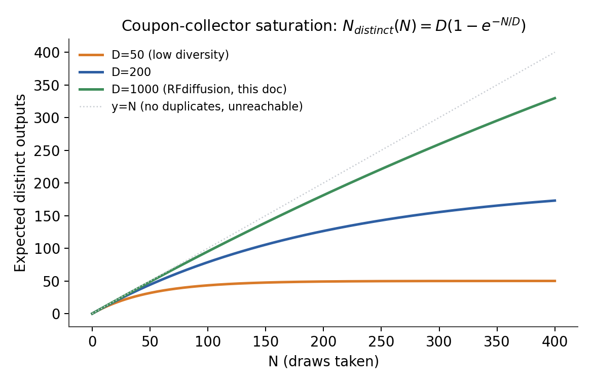
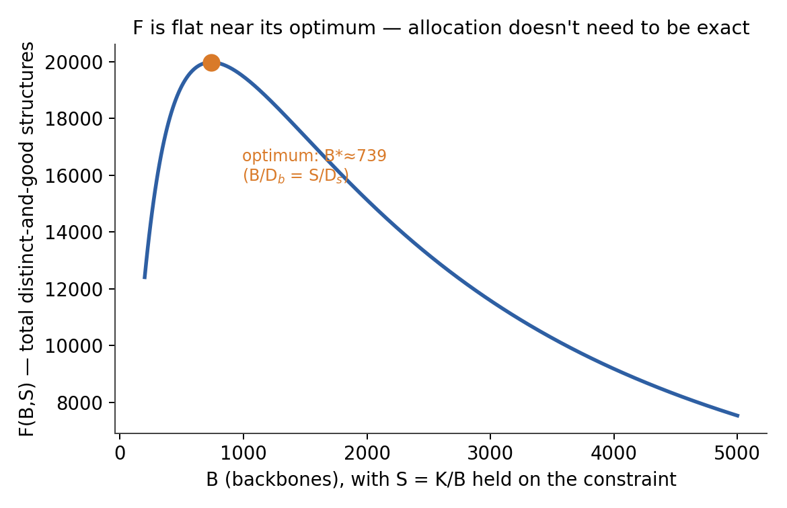
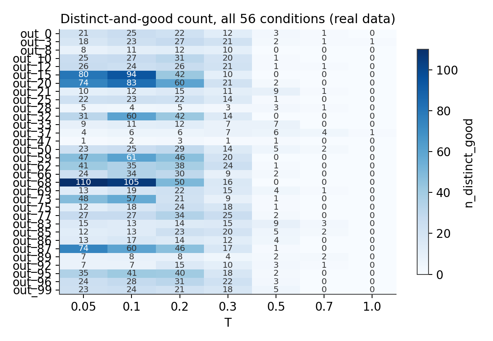
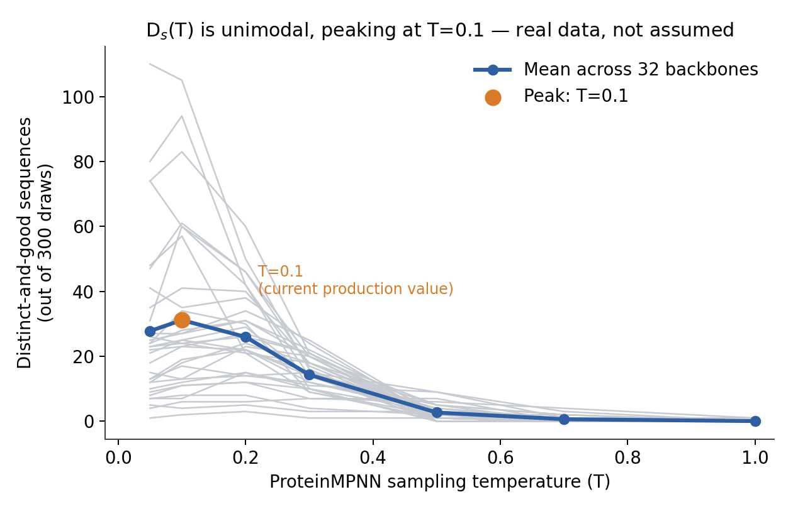
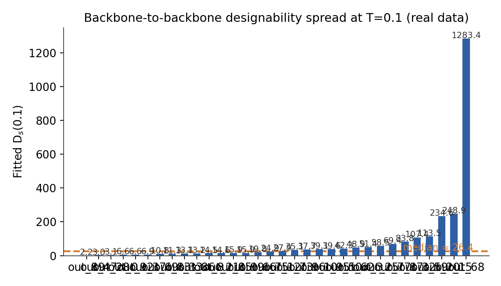
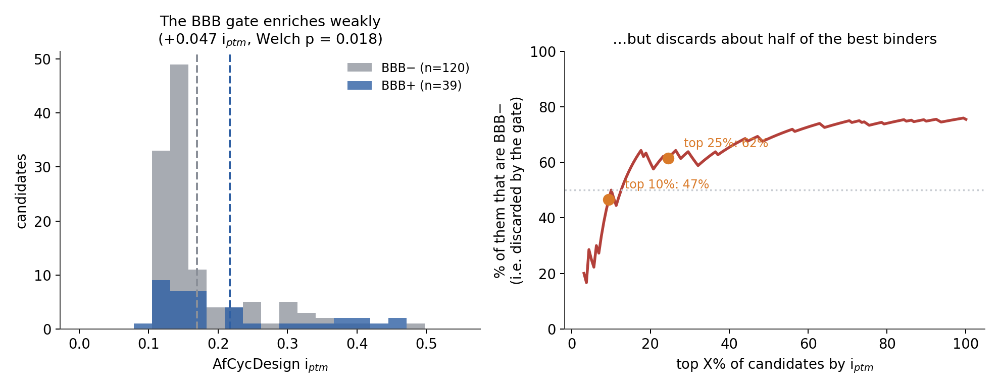
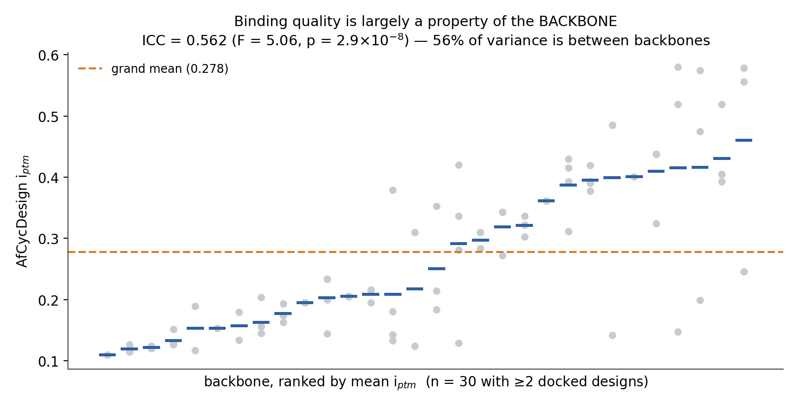
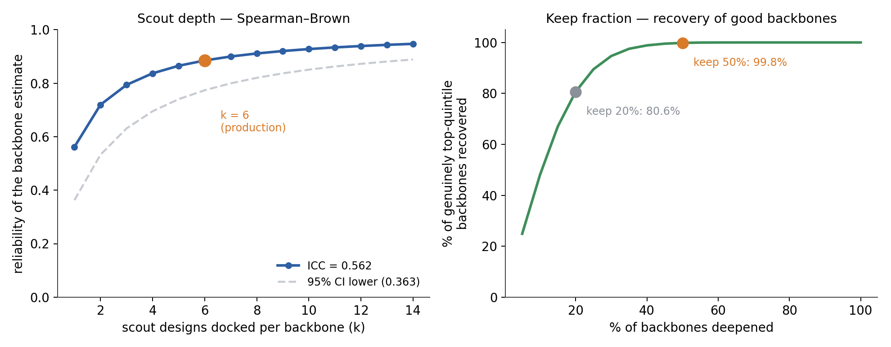
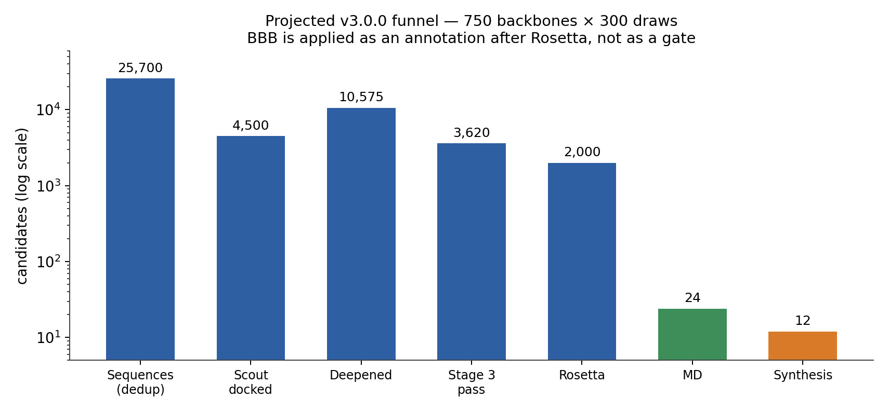

# Mathematical Derivations — OXTR Pipeline Design Decisions

**Document version:** v3.0.0
**Last updated:** 2026-09-24
**Pipeline version this describes:** derives the parameters for pipeline **v3.0.0**
(not yet adopted — `SOP.md` remains at v2.0.0 until the Stage 2/3/5 changes below
are written into it). The bump is MAJOR under `SOP.md`'s own rule because the BBB
filter changes from a gate to a router, which changes what gates candidate
advancement.

This document is the canonical reference for every non-arbitrary numerical decision
in the OXTR binder pipeline — every parameter here is derived from an explicit model
and stated assumptions, not picked by feel. If a number appears in `SOP.md` or
`METHODS_AND_RESULTS.md` and it was not simply measured, its derivation belongs here.

Sections are ordered to follow the pipeline funnel, so reading top to bottom walks
the same path a candidate takes:

| Part | Sections | Question it answers | Pipeline stage |
|---|---|---|---|
| **I** | 0–8 | How many backbones (B), sequences per backbone (S), at what sampling temperature (T)? | Stages 1–2 |
| **II** | 9 | How much of the ProteinMPNN output is duplicated, and what survives deduplication? | Stage 2 output |
| **III** | 10–20 | How many sequences enter cofolding, and which ones? | Stage 3 |
| **IV** | 21–22 | What does the rest of the funnel cost, and what profile of candidate should it yield? | Stages 4–7 |
| **V** | 23–30 | How many candidates go to physical synthesis and assay? | Stage 8 |

### Document version history

Semantic versioning matching `SOP.md`'s convention, applied to the *derivations*:
**MAJOR** — a derived production parameter changes, or a section is restructured;
**MINOR** — a new derivation added without changing existing parameters;
**PATCH** — corrections, clarifications, and added citations.

| Version | Date | Summary |
|---|---|---|
| v1.0.0 | 2026-09-20 | Part I — B/S/T allocation model derived; pre-experiment estimates only. |
| v1.1.0 | 2026-09-22 | Part I Section 7 — B=750, S=53, T=0.1 validated against the 16,800-sequence D_s(T) experiment. |
| v2.0.0 | 2026-09-23 | Part II added — synthetic candidate selection (Wave 1 = 12 compounds). |
| **v3.0.0** | 2026-09-24 | **Reordered to follow the pipeline funnel.** New: deduplication measurement (Part II), docking-stage allocation and backbone scouting (Part III), downstream compute budget and expected candidate profile (Part IV). Synthetic candidate selection renumbered from Part II to Part V, sections 9–16 → 23–30. Production parameters newly derived here: scout depth k=6, backbone keep fraction 50%, Boltz2 staged behind AfCycDesign, BBB reclassified from gate to router. |

**Note on external references.** Part I's section numbers (0–8) are unchanged in
v3.0.0 because `SOP.md`, `README.md` and `OXTR_Stage1_v2_ScaleUp.sh` cite
"Section 7" and "Section 3.3" directly. References to the old "Part II" for
synthesis selection now point to **Part V**.

---

# Part I — Backbone / sequence sampling allocation

**Goal:** rigorously derive the number of backbones (B), sequences per backbone (S), and ProteinMPNN sampling temperature (T) that maximize the number of genuinely distinct, still-good-quality structures entering downstream filtering, subject to B·S = 40,000.

**Starting point this section argues away from:** B = 10,000, S = 4, T = 0.1 (the
pilot's original defaults, never itself derived). **Current production values, as
resolved in Section 7: B = 750, S = 53, T = 0.1.**

---

## 0. Notation key (all symbols used below)

| Symbol | Meaning | Units / range |
|---|---|---|
| $B$ | Number of RFdiffusion backbones generated | count, integer $\geq 1$ |
| $S$ | Number of ProteinMPNN sequences designed per backbone | count, integer $\geq 1$ |
| $T$ | ProteinMPNN sampling temperature | dimensionless, $>0$ (0.1–0.3 typical) |
| $K$ | Total structures entering downstream filtering, $K = B \cdot S$ | count, fixed at 40,000 here |
| $D_b$ | Effective number of distinguishable, good-quality backbone shapes RFdiffusion can produce for this target/length | count (estimated $\approx 1{,}000$) |
| $D_s(T)$ | Effective number of distinguishable, good-quality sequences ProteinMPNN can produce for one fixed backbone at temperature $T$ | count (estimated $\approx 5\text{–}10$ at $T=0.1$) |
| $N$ | Generic number of draws in the coupon-collector formula (stands in for $B$ or $S$ depending on which stage) | count |
| $D$ | Generic effective category count in the coupon-collector formula (stands in for $D_b$ or $D_s$) | count |
| $N_{\text{distinct}}(N)$ | Expected number of distinct categories seen after $N$ draws | count |
| $p_i$ | True probability (weight) of category $i$ being sampled by the generative model | probability, $\sum_i p_i = 1$ |
| $f_1$ | Number of bins/clusters containing exactly 1 backbone ("singletons") | count |
| $f_2$ | Number of bins/clusters containing exactly 2 backbones ("doubletons") | count |
| $S_{\text{obs}}$ | Number of distinct bins/clusters actually observed | count |
| $\hat{S}$ | Chao1 estimate of true total richness | count |
| $x$ | $B/D_b$ — backbone stage's fractional saturation | dimensionless |
| $y$ | $S/D_s$ — sequence stage's fractional saturation | dimensionless |
| $h(z)$, $\varphi(z)$ | Helper functions used in the Lagrangian derivation: $h(z)=\dfrac{1}{e^z-1}$, $\varphi(z)=z\,h(z)$ | dimensionless |
| $\lambda$ | Lagrange multiplier | — |
| $r$ | Common optimal fractional saturation, $r = B^*/D_b = S^*/D_s$ | dimensionless |
| $B^*$, $S^*$ | Optimal backbone count / sequences-per-backbone under the derived allocation rule | count |
| $F(B,S)$ | Objective: total distinct-and-good structures produced by allocation $(B,S)$ | count |
| $F^*$ | Objective value at the optimal allocation $(B^*,S^*)$ | count |

---

## 1. Model and its validity

### 1.1 The saturating-diversity model

Each stage (backbone generation, sequence design per backbone) is modeled as sampling from a distribution with some effective number of distinguishable, good-quality outputs — D_b for RFdiffusion, D_s(T) for ProteinMPNN at temperature T. The number of distinct outputs found after N draws is modeled with the coupon-collector saturation curve:

$$
N_{\text{distinct}}(N) \;\approx\; D \left(1 - e^{-N/D}\right)
$$

*where:* $N$ = number of draws taken ($B$ for the backbone stage, $S$ for the sequence stage); $D$ = effective number of distinguishable good-quality categories available at that stage ($D_b$ or $D_s$); $N_{\text{distinct}}(N)$ = expected number of distinct categories found after $N$ draws.

*What this shape means concretely:* every curve starts near the dotted "no duplicates" line (early draws are almost always new) and bends over toward a ceiling of D (once most of the available diversity has been seen, a new draw is increasingly likely to be a repeat). A small D (orange, D=50) saturates fast and hard — this is why S=4 sequences/backbone under the *old* defaults was so wasteful once $D_s$ turned out to be in the tens, not thousands. A large D (green, D=1000, RFdiffusion's actual fitted value in this doc) stays close to the "no duplicates" line over the whole range plotted — consistent with backbones being far from saturated even at B≈750–1,000.

Total distinct-and-good structures is modeled as the product of the two saturating curves:

$$
\text{Total}(B, S) \;\approx\; \Big[D_b\big(1 - e^{-B/D_b}\big)\Big] \cdot \Big[D_s\big(1 - e^{-S/D_s}\big)\Big]
$$

*where:* $B$ = backbones generated; $D_b$ = effective distinguishable backbone count; $S$ = sequences generated per backbone; $D_s$ = effective distinguishable good-sequence count per backbone (at the chosen $T$); the two bracketed terms are each stage's coupon-collector saturation, multiplied because a structure only counts once it is both a distinct-enough backbone and a distinct-enough sequence on that backbone.

subject to

$$
B \cdot S = K = 40{,}000
$$

where $K$ is the fixed total structure budget entering downstream filtering.

### 1.2 Is the coupon-collector form justified?

The formula above is **exact only under uniform category probabilities** (all D modes equally likely). For N i.i.d. draws over categories with probabilities {pᵢ}, the true expectation is:

$$
\mathbb{E}[\text{distinct}(N)] \;=\; \sum_i \left[1 - (1-p_i)^N\right]
$$

*where:* the sum runs over all categories $i$ (all possible backbone shapes or sequences); $p_i$ = the true probability the generative model assigns to category $i$ (not assumed equal across $i$, unlike the coupon-collector form above); $N$ = number of draws. This reduces to the coupon-collector formula only in the special case $p_i = 1/D$ for all $i$.

Generative models conditioned on a specific target pocket almost certainly have **skewed**, not uniform, mode probabilities (a few dominant backbone topologies, a long tail of rare ones). Non-uniformity:
- Makes the real curve rise faster early (dominant modes found almost immediately) then have a long slow tail (rare modes).
- Biases a uniform-model fit depending on which regime of the curve you're fitting to.

**This is structurally the species-richness estimation problem from ecology** (backbones = individuals, shape bins = species). The appropriate tools are non-parametric richness estimators, not a single-point coupon-collector solve:

- **Chao1 estimator**:

$$
\hat{S} \;=\; S_{\text{obs}} + \frac{f_1^2}{2 f_2}
$$

*where:* $\hat{S}$ = estimated true total richness (this is the refined estimate of $D_b$); $S_{\text{obs}}$ = number of distinct bins/clusters actually observed (e.g. 95 in the current data); $f_1$ = number of bins hit exactly once ("singletons"); $f_2$ = number of bins hit exactly twice ("doubletons"). No distributional assumption needed beyond "some categories are rarer than others." Has a known variance formula → CI.
- **Effective diversity (Hill numbers)**, e.g. inverse Simpson index 1/Σpᵢ², may be the more relevant quantity than raw richness, since it down-weights near-unreachable rare modes that don't matter for realistic sample sizes.

**Verdict:** keep the saturating-curve intuition (qualitatively correct), but replace the single-point uniform plug-in with Chao1/rarefaction fitting (Section 2).

---

## 2. Fitting D_b rigorously

### 2.1 What was done vs. what's needed

Current estimate: 95/100 backbones in distinct coarse-shape bins (3 features: residue count, end-to-end Cα distance, radius of gyration, each coarsely binned) → solving

$$
95 \approx D\left(1 - e^{-100/D}\right)
$$

for $D$ gives **$D_b \approx 1{,}000$**. This is a single-equation, single-point solve with no error bars.

### 2.2–2.3 Possible refinements to D_b, considered and deprioritized

Two refinements were considered before running the Section 3 experiment: (a) a
proper rarefaction/bootstrap Chao1 refit of D_b instead of the single-point solve
above, and (b) replacing the coarse 3-feature shape binning with pairwise Cα-RMSD
clustering, since coarse binning can both over- and under-merge similar backbones.
**Neither was executed** — the Section 7 result uses the original D_b≈1,000 point
estimate directly. This turned out not to matter: Section 6's sensitivity analysis
shows the optimal allocation only moves by √(error) in D_b, so even a factor-of-4
error in this point estimate would only shift B* by 2×. Revisit only if a future
run needs tighter precision than that sensitivity bound provides.

---

## 3. Experimental design for D_s(T)

### 3.1 Mechanistic prior on functional form

ProteinMPNN's per-position categorical:

$$
p_i \;\propto\; \exp\!\left(\frac{\text{logit}_i}{T}\right)
$$

As $T \to 0$, the distribution collapses to argmax ($D_s \to 1$); as $T \to \infty$, it approaches uniform over the constrained sequence space. The effective number of distinguishable categories for one draw is its **perplexity**, $e^{H}$ where $H = -\sum_i p_i \ln p_i$ is the Shannon entropy — computable directly from ProteinMPNN's own per-position logits with **zero extra sampling cost**, since these are already produced at generation time. Use this as a prior/sanity check against the empirical fit (autoregressive coupling between positions and downstream quality filtering both break the naive per-position independence assumption, so it's not a substitute for measurement).

### 3.2 Key refinement: D_s(T) is likely unimodal, not monotonic

"Distinct AND still-good" is not the same as raw diversity. Raw sequence diversity rises monotonically with T, but the fraction passing quality filters falls — so distinct-and-good count plausibly **rises then falls** with T, not saturates monotonically. The experiment should be designed to detect a peak.

### 3.3 Concrete design (no new RFdiffusion cost)

- **Backbones:** 5–10, spanning the D_b cluster structure (e.g. near cluster centroids) — designability plausibly varies by backbone; this is an assumption in the product model worth testing, not asserting.
- **Temperature grid:** T ∈ {0.05, 0.1, 0.2, 0.3, 0.5, 0.7, 1.0} (log-ish spaced; already have a point near the bottom).
- **Samples per (backbone, T):** 200–500, enough to build a rarefaction curve per condition the same way as Section 2.
- **Distinctness metric:** sequence-space (Hamming/edit distance or %identity clustering) — no structure prediction needed.
- **Quality metric:** ProteinMPNN score as the always-available signal; spot-check with a coarser but more meaningful proxy (ESM pseudo-perplexity, or a quick ESMFold pass on a subsample).
- **Fit directly on quality-filtered survivors:** apply the quality filter first, then run rarefaction/Chao1 on survivors at each T. This bakes the quality/diversity tradeoff into one empirically fit D_s(T) curve, rather than separately fitting and multiplying raw-diversity(T) × pass-rate(T) (which adds its own untested independence assumption). Expect, and check for, a peak in T.

---

## 4. Constrained optimization

Maximize

$$
F(B,S) \;=\; \Big[D_b\big(1-e^{-B/D_b}\big)\Big] \cdot \Big[D_s\big(1-e^{-S/D_s}\big)\Big] \qquad \text{subject to} \qquad B \cdot S = K
$$

Lagrangian on $\ln F$, with $x = B/D_b$, $y = S/D_s$, reduces (via the constraint $xy = K/(D_b D_s)$) to:

$$
x \, h(x) \;=\; y \, h(y), \qquad h(z) = \frac{1}{e^z - 1}
$$

*where:* $x = B/D_b$ (backbone stage's fractional saturation); $y = S/D_s$ (sequence stage's fractional saturation); $h(z)$ is a helper function of a single dummy variable $z$ (substitute $x$ or $y$ into it as needed) arising from differentiating the log-saturation curve.

Defining $\varphi(z) = z\,h(z) = \dfrac{z}{e^z-1}$ (the Planck/Bose–Einstein function), $\varphi$ is strictly monotonically decreasing for $z>0$, hence injective — so the only solution is $x=y$:

$$
\frac{B}{D_b} \;=\; \frac{S}{D_s} \qquad \text{at the optimum}
$$

I.e., allocate samples so **both stages reach the same fractional saturation** of their own coupon-collector curve. Solving with the constraint:

$$
B^{*} \;=\; \sqrt{\dfrac{K \, D_b}{D_s}}, \qquad
S^{*} \;=\; \sqrt{\dfrac{K \, D_s}{D_b}}, \qquad
\frac{B^{*}}{S^{*}} \;=\; \frac{D_b}{D_s}, \qquad
r \;=\; \frac{B^{*}}{D_b} \;=\; \frac{S^{*}}{D_s} \;=\; \sqrt{\dfrac{K}{D_b D_s}}
$$

*where:* $B^*$ = optimal number of backbones; $S^*$ = optimal number of sequences per backbone; $K$ = fixed total budget (40,000); $D_b, D_s$ = the effective distinguishable-output counts for each stage as defined in Section 0; $r$ = the common fractional saturation both stages reach at the optimum (a single number that tells you how "used up" each stage's diversity is).

**Limiting-behavior checks:**
- $D_s \to \infty$ ($T$ very high, unlimited quality-passing diversity): $r \to 0$, $F^{*} \to K$ — every draw finds something new, total approaches the full budget. Correct.
- $D_s \to 0$ ($T \approx 0$, collapsed): $F^{*} \to D_b D_s \to 0$ — nearly everything is a wasted duplicate. Matches the qualitative $T=0.1$ observation.

> **Caption updated 2026-09-24.** This figure was drawn with D_b ≈ 1000 and
> D_s ≈ 73.2. Both inputs have since changed: D_s is 37.6 under the
> Cys-constrained measurement (Section 9 and Part I Section 7), and D_b is now
> known to be unidentifiable (Section 14 note, `LIMITATIONS.md` O2). The
> *shape* of the curve — its flatness near the optimum, which is the point
> being made — is unaffected; the absolute axis values are not current.

*Reading this curve:* it's $F$ swept along the constraint line ($S=K/B$), using the actual fitted $D_b\approx1{,}000$ and $D_s(0.1)\approx73.2$ from Section 7 rather than a hypothetical example — so the marked optimum ($B^*\approx739$) is the same number the final recommendation is built on. The curve rises steeply for very small $B$ (too many sequences wasted on too few backbone shapes), peaks, then falls off more gently — this asymmetry, and the broad flat-topped region around the peak, is the visual version of the Section 6 sensitivity result: getting $D_b$ or $D_s$ somewhat wrong costs little, but going too far in either direction (in particular, staying near the old $B=10{,}000$ default, off the right edge of this plot) costs a lot.

---

## 5. Plugging in pre-experiment estimates (motivation for running Section 3)

Before the Section 3 experiment was run, $D_b \approx 1{,}000$ (Section 2) and a rough
$D_s(0.1) \approx 7$ (solved from "near-duplicates, 1–2 substitutions across 4
samples") were used as placeholder inputs to check whether reallocating away from the
original 10,000×4 default was even worth investigating. **Every plausible $D_s(0.1)$
value in the 3–15 range gave the same directional answer — too many backbones, too
few sequences per backbone, by roughly an order of magnitude** — which is what
justified running the real experiment rather than tuning by feel.

These specific pre-experiment numbers are now superseded by an actual measurement:
Section 7 found $D_s(0.1) \approx 73$, roughly 10× higher than any guess used here.
The pre-experiment estimate of "$T=0.1$ is probably too conservative, try 0.2–0.3"
(reasoned from $D_s(0.1)$ being small) was **tested directly in Section 7 and found
wrong** — raising $T$ made things worse, not better. Kept here as the documented,
falsified hypothesis that motivated the experiment, not as current guidance — see
Section 7 for the real numbers and the reason the original T reasoning didn't hold up.

---

## 6. Sensitivity analysis

From $B^{*} = \sqrt{K D_b/D_s}$:

$$
\frac{d(\ln B^{*})}{d(\ln D_b)} \;=\; \frac{1}{2}
$$

— square-root sensitivity. *where:* this derivative is the elasticity of the optimal backbone count with respect to the $D_b$ estimate — a value of $\tfrac{1}{2}$ means a doubling of $D_b$ (a 100% error) only requires $B^*$ to change by $\sqrt{2} \approx 41\%$. A factor-of-4 error in $D_b$ moves optimal $B$ by only $2\times$. Given $D_b$'s CI is plausibly wide ($N=100$ sampling a $D \approx 1{,}000$ space), this is the reassuring part.

More importantly, **$F^*$ is even less sensitive than the argmax location** — near a smooth interior optimum, $F$ is locally flat in log-deviation from the optimal split (second-order vs. first-order effect). Example: $D_b=1000$, $D_s=50$ → optimal split $(894, 45)$ gives $F^{*}\approx 841$; an equal split $(200, 200)$ — a ~4× allocation error — gives $F\approx 785$, a ~7% loss, not catastrophic. Practical takeaway: $D_b$ and $D_s(T)$ don't need to be pinned precisely — within a factor of ~2 (achievable via Sections 2–3) captures nearly all the achievable diversity.

---

## 7. Recommendation — FINAL, validated against the Section 3 experiment (2026-09-22)

**The Section 3 validation experiment has been run**: 8 backbones (`out_0, 12, 25,
37, 50, 62, 75, 87`) × T ∈ {0.05, 0.1, 0.2, 0.3, 0.5, 0.7, 1.0} × 300 sequences
each, no new RFdiffusion cost. Quality threshold fixed per-backbone at the T=0.1
median score (an absolute, non-circular bar applied identically across all T for
that backbone), then exact distinct-sequence count taken among quality-passing
survivors at each (backbone, T). Full data:
`analysis/stage_0_controls/ds_t_experiment_results.csv`.

### 7.0 Full rundown of what was actually run

**Purpose.** Section 3's design was still an untested proposal — this run is
what turned it into a real measurement, replacing the interim, admittedly
provisional B/S/T guidance with numbers anchored in actual ProteinMPNN output.

**Setup, concretely:**
- **Backbones:** 8 existing RFdiffusion backbones from the 100-backbone pilot
  (`out_0, 12, 25, 37, 50, 62, 75, 87`) — reused as-is, no new Stage 1 compute.
  Chosen to spread across the pilot's design space rather than clustering near
  one another.
- **Temperature grid:** T ∈ {0.05, 0.1, 0.2, 0.3, 0.5, 0.7, 1.0} — log-ish
  spaced, anchored at the current production value (0.1) with points both below
  and well above it so a peak (Section 3.2's prior) could actually be seen if
  present, not just approached from one side.
- **Sequences per (backbone, T):** 300, generated with ProteinMPNN
  (`--num_seq_per_target 300 --sampling_temp T --batch_size 50`), backbone-only
  (no receptor context) — this measures the sequence-design step's own raw
  designability/diversity curve, independent of downstream receptor-aware
  filtering. Total: 8 × 7 × 300 = 16,800 sequences generated
  (`scripts/stage0_controls/ds_t_experiment.py`, sharded 4-way across GPUs via
  `ds_t_shard.py`).
- **Quality threshold — fixed per backbone, not per (backbone, T).** For each
  backbone, the median ProteinMPNN score of its own T=0.1 batch was taken as
  that backbone's quality bar, then applied unchanged to every other T for that
  same backbone. This keeps the bar an absolute, external standard rather than
  a moving target that would make "distinct-and-good count" trivially different
  at every T just because the threshold moved with it (a non-circularity
  requirement — see Section 3.3).
- **Distinctness:** exact distinct-sequence count (no fuzzy clustering) taken
  among the quality-passing survivors at each (backbone, T) — i.e. the
  diversity/quality tradeoff is baked into one number per condition, not
  computed as two separate curves and multiplied together (Section 3.3's
  stated reason: multiplying separately fit curves adds an untested
  independence assumption that measuring the combined statistic directly
  avoids).
- **D_s(T) point-estimate fit (at T=0.1 only, the value the B/S formula
  actually needs):** solved the coupon-collector saturation equation
  $D\left(1-e^{-N/D}\right) = n_{\text{distinct-and-good}}$ for $D$, with
  $N=300$ (total draws) — the same functional form used throughout this
  document (Section 1.1, Section 5.1's $D\approx7$ worked example), just
  fit per backbone here instead of assumed.

**Full per-condition results** (`n_distinct_good` = exact distinct sequences
passing that backbone's fixed quality bar, out of 300 draws):

| Backbone | T=0.05 | T=0.1 | T=0.2 | T=0.3 | T=0.5 | T=0.7 | T=1.0 | D_s(0.1) fit |
|---|---|---|---|---|---|---|---|---|
| 0  | 85 | 106 | 52 | 15 | 0 | 0 | 0 | 114.3 |
| 12 | 26 | 42  | 37 | 24 | 0 | 0 | 0 | 42.0 |
| 25 | 70 | 71  | 39 | 15 | 1 | 0 | 0 | 72.1 |
| 37 | 9  | 17  | 26 | 18 | 5 | 0 | 0 | 17.0 |
| 50 | 52 | 73  | 49 | 9  | 1 | 0 | 0 | 74.3 |
| 62 | 67 | 82  | 31 | 2  | 0 | 0 | 0 | 84.4 |
| 75 | 5  | 5   | 7  | 5  | 0 | 0 | 0 | 5.0 |
| 87 | 75 | 74  | 52 | 14 | 0 | 0 | 0 | 75.4 |
| **Mean** | **48.6** | **58.8** | **36.6** | **12.8** | **0.9** | **0.0** | **0.0** | — |

*The same table as a picture:* the dark column at T=0.1 is the whole result in one glance — every backbone's row is darkest (or tied for darkest) in that column, and the T≥0.5 columns are uniformly blank (0 everywhere). The row-to-row banding (out_75 pale throughout, out_0 dark throughout) is the designability spread discussed next.

Two things this table makes visible that the summary numbers alone don't:
- **The T=0.1 peak holds for essentially every individual backbone, not just
  the mean** — only `out_37` peaks slightly later (at T=0.2, 26 vs 17), every
  other backbone's own row peaks at T=0.1. The aggregate result isn't an
  artifact of averaging together backbones that peak at different T.
- **Backbone-to-backbone designability spread is real and large** even at the
  shared, near-optimal T=0.1: `out_75` tops out at 5 distinct-and-good
  sequences out of 300 draws, `out_0` reaches 106 — over 20× apart. This is
  the direct evidence behind Section 3.3's flagged-but-untested "designability
  varies by backbone" assumption, and the reason the final $D_s$ point estimate
  below uses the median (robust to `out_37`/`out_75` pulling the mean down)
  rather than the mean.

**Result 1 — T=0.1 (the existing production value) is at or very near the true
peak, not too conservative.** Mean distinct-and-good count across the 8 backbones:
T=0.05→48.6, **T=0.1→58.8**, T=0.2→36.6, T=0.3→12.8, T≥0.5→~0. Raising T to
0.2–0.3, as this document's earlier interim recommendation suggested, would have
made things *worse*: raw sequence diversity does keep rising with T (expected),
but the fraction clearing a fixed quality bar collapses much faster than
diversity grows, so distinct-and-good count falls past T≈0.1. **T=0.1 stays as
the production temperature — no change from current practice.**

*What the faint lines show:* each is one backbone's own curve — the thick blue mean line isn't hiding backbones that peak elsewhere. `out_37` (visibly the one faint line still rising slightly at T=0.2) is the only exception noted above; every other backbone's own peak sits at T=0.1, same as the mean.

**Result 2 — D_s(0.1), fit via the saturation curve (not just the raw count) at
N=300 draws:** per-backbone estimates ranged **5.0 to 114.3** (real, substantial
backbone-to-backbone designability variance — confirms the "designability varies
by backbone" assumption flagged in Section 3.3 as worth testing, not asserting).
Median **D_s(0.1) ≈ 73.2**, used below as the point estimate (more robust to the
two low outliers, `out_37` and `out_75`, than the mean).

**Result 3 — final (B, S) allocation, solving Section 4's formula with
D_b=1,000 (Section 2 point estimate) and this measured D_s(0.1)=73.2:**

$$B^{*} = \sqrt{K D_b/D_s} \approx 739, \qquad S^{*} = \sqrt{K D_s/D_b} \approx 54$$

**Recommended: B = 750 backbones, S = 53 sequences/backbone** (B·S ≈ 39,750 ≈
K=40,000), **T = 0.1 (unchanged)**.

Expected yield: F* ≈ 19,987 distinct-and-good structures entering downstream
filtering — versus F(10,000×4) ≈ 3,893 under the original production defaults
at this same D_s. **A ~5.1× improvement in useful output for the identical total
compute budget.**

**Sensitivity range** (using the full per-backbone D_s spread, 17–114, not just
the median): B* ranges 592–1,534, S* ranges 26–68. The *direction* — far fewer
backbones, far more sequences per backbone than 10,000×4 — is robust across this
entire range; only the precise split moves. If hedging against per-backbone
designability variance is preferred over the point estimate, **B=1,000, S=40**
is a reasonable, still dramatically-improved, more conservative alternative.

**This supersedes the earlier interim recommendation (B≈2,000–2,500, S≈16–20,
T→0.2–0.3) — that guidance was explicitly provisional pending this experiment,
and the experiment moved the numbers substantially, including reversing the
direction on T.**

---

## 8. Open assumptions still worth testing

1. **Independence across backbones:** the product model assumes D_s(T) is the same for every backbone. The multi-backbone design in Section 3.3 tests this rather than assuming it.
2. **Product-of-saturating-curves as the joint model:** assumes no backbone-quality × sequence-designability interaction beyond what D_s(T) captures. Plausible but untested.
3. **Continuous relaxation validity:** the closed form assumes B\*, S\* land comfortably in the interior (not near 1 or K). Current example numbers are fine; would need rechecking if D_s(T) comes back very small or very large at the eventually-chosen T.

---

# Part II — Sequence deduplication

**Goal:** establish how many of the $B \cdot S$ nominal ProteinMPNN outputs are actually distinct molecules, since every downstream count — docking load, shortlist size, compute budget — is a count of *distinct* sequences, not of draws.

**Why this needs its own section:** Part I optimizes for *distinct* output and its $D_s(T)$ term already encodes saturation, but the production pipeline had no explicit deduplication step, and the funnel counts in `METHODS_AND_RESULTS.md` were written in terms of raw draws. At $T = 0.1$ the gap between the two is large.

## 9. Duplicate rate at the production temperature

ProteinMPNN sampling at low temperature is strongly repetitive. Measured directly on the $D_s(T)$ experiment's raw FASTA output (8 backbones × 300 draws at $T = 0.1$), taking a random subsample of $S = 53$ draws per backbone to match production:

| Backbone | Unique of 53 draws | Duplicate rate | Unique of 300 draws |
|---|---:|---:|---:|
| b0 | 49 | 7.5% | 231 |
| b12 | 27 | 49.1% | 100 |
| b25 | 43 | 18.9% | 179 |
| b37 | **12** | **77.4%** | 35 |
| b50 | 39 | 26.4% | 174 |
| b62 | 44 | 17.0% | 220 |
| b75 | **13** | **75.5%** | 28 |
| b87 | 47 | 11.3% | 191 |

$$\mathbb{E}[\text{unique} \mid S{=}53,\ T{=}0.1] = 34.2 \quad (35.4\%\ \text{duplicates})$$

Cross-backbone duplication is small by comparison: of the pilot's 400 sequences, 388 are distinct (3.0% duplicated across backbones). Total expected loss is therefore roughly 35% within backbones plus ~3% globally.

**Scale-up consequence.**

$$N_{\text{unique}} \approx B \cdot \mathbb{E}[\text{unique}] = 750 \times 34.2 \approx 25{,}700$$

against a nominal $B \cdot S = 39{,}750$. **Every funnel count downstream of Stage 2 should be computed from ~25,700, not 39,750.**

**The variance matters more than the mean.** Unique yield ranges from 12 to 49 across eight backbones — a 4× spread. Backbones like b37 and b75 are effectively exhausted at 53 draws, contributing a quarter of what the nominal $S$ implies, while b0 is nowhere near saturation. This is exactly the per-backbone variation in $D_s$ that Part I Section 8's first open assumption flags as untested, now measured: **$D_s$ is not constant across backbones.**

**Production requirement.** Deduplicate within each backbone first, then globally, immediately after Stage 2 and before any docking allocation. Backbones yielding fewer than ~15 unique sequences should be flagged in the run log — they indicate a backbone whose sequence space ProteinMPNN has saturated, and they will contribute proportionally less to the scouting design in Part III.

---

# Part III — Docking-stage allocation and backbone scouting

**Goal:** rigorously derive how many BBB-filtered sequences should enter Stage 3 (AfCycDesign / Boltz2 cofolding), given that cofolding is the most compute-expensive per-candidate step in the pipeline. Like Part I this is a "how many samples" problem, but the binding constraint is different again: Part I is limited by *diversity per unit compute*, Part V by *assay slots*, and this part by *GPU-hours against a filter whose discriminating power was never measured*.

**Starting point this section argues away from:** "dock whatever the BBB filter passes, ranked by BBB probability" — the pilot's inherited behaviour, never derived, and resting on a pass-rate figure that turns out not to match the documented threshold.

**Headline result:** the docking load for the v2.0.0 scale-up is **~3,180 candidates, not ~22,260**, and at measured throughput that is **~6 GPU-hours, not weeks**. The BBB gate weakly enriches for binding quality but is useless as a *ranking*, and it discards roughly half of the best-scoring candidates.

---

## 10. Notation and goal

| Symbol | Meaning | Units / range |
|---|---|---|
| $N_{\text{seq}}$ | Sequences produced by Stage 2, $= B \cdot S$ | count; 39,750 at $B{=}750$, $S{=}53$ |
| $\tau$ | Decision threshold on B3BPFN permeability probability | probability; documented as 0.215 |
| $f(\tau)$ | Fraction of Stage 2 sequences with $p_{\text{BBB}} > \tau$ | probability, measured |
| $N_{\text{dock}}$ | Candidates entering Stage 3 cofolding | count, $\leq N_{\text{seq}}$ |
| $c_A$, $c_B$ | Wall-clock cost per candidate, AfCycDesign and Boltz2 | seconds/run, measured |
| $G$ | GPUs available for sharding | count; 4 on Woody |
| $q$ | Fraction of docked candidates clearing the Stage 3 checks | probability; 0.24 from the pilot |
| $\Delta$ | Mean difference in $i_{\text{ptm}}$ between BBB+ and BBB− candidates | dimensionless |
| $d$ | Cohen's $d$, standardized effect size of that difference | dimensionless |
| $\rho_{\text{BBB}}$ | Spearman correlation of $p_{\text{BBB}}$ against $i_{\text{ptm}}$ | dimensionless |

---

## 11. Auditing the gate — what the BBB filter actually passes

The projected funnel in `METHODS_AND_RESULTS.md` §8 records **224 BBB+ (56%)** of 400 pilot sequences, and a docked set of **112** described as "top 50% of BBB+ by probability". Neither figure is consistent with the documented threshold $\tau = 0.215$. Recounting directly from `stage_5_permeability/bbb_permeability_predictions.csv`:

| Threshold $\tau$ | Count of 400 | $f(\tau)$ | Correspondence |
|---|---:|---:|---|
| 0.05 | 231 | 57.8% | matches the documented "224 / 56%" |
| 0.10 | 112 | 28.0% | matches the documented "docked 112" |
| **0.215** (documented gate) | **39** | **9.8%** | the gate as actually specified |

So the funnel's two recorded counts correspond to thresholds of roughly 0.05 and 0.10 respectively, not to the 0.215 gate stated in `SOP.md`. The 56% figure is not a measurement of the documented filter, and **the `METHODS_AND_RESULTS.md` §8.1 projection of ~22,260 BBB+ candidates inherits that error**.

**The v1.2 pass rate, previously unmeasured.** `METHODS_AND_RESULTS.md` §8.1 flags explicitly that "the relabeled v1.2 classifier's pass rate on a comparable batch hasn't been re-measured". It has now been measured, by rescoring the pilot's own 400 sequences through `B3BPFN_v1.2_production/predict_peptide.py`:

$$f_{v1.2}(0.215) = \frac{32}{400} = 8.0\%$$

(one of the 32 carries the nearest-neighbor hard-negative flag). v1.2 is slightly more conservative than v1.0's 9.8%, consistent with the relabeling having removed positive training signal on hormone-like peptides.

**Projected docking load.**

$$N_{\text{dock}} = N_{\text{seq}} \cdot f_{v1.2}(\tau) = 39{,}750 \times 0.080 \approx 3{,}180$$

against the ~22,260 currently projected — a factor of **7.0** smaller.

---

## 12. Throughput model

Per-candidate wall-clock costs, measured from output-file timestamps across the pilot's 39-candidate Stage 3 runs (single GPU, sequential):

$$c_A = 27.7\ \text{s/run} \qquad c_B = 42.1\ \text{s/run}$$

Sharded across $G$ GPUs, total wall-clock hours for a two-tool stage is

$$H_{\text{both}}(N) = \frac{N (c_A + c_B)}{3600\,G}$$

**A staging refinement.** Boltz2 was demoted in v2.0.0 to a structure-only cross-check (pose agreement), never a ranking signal — §16.4–16.5 of `METHODS_AND_RESULTS.md`. A cross-check on survivors does not need to run at full width. Running Boltz2 only on the fraction $q \approx 0.24$ that clears the AfCycDesign and disulfide checks gives

$$H_{\text{staged}}(N) = \frac{N c_A + q N c_B}{3600\,G}$$

| $N_{\text{dock}}$ | AfCycDesign only | Both, full width | Staged ($q{=}0.24$) |
|---:|---:|---:|---:|
| 1,000 | 1.9 h | 4.8 h | 2.6 h |
| **3,180** | **6.1 h** | 15.4 h | **8.3 h** |
| 12,000 | 23.1 h | 58.2 h | 31.5 h |
| 39,750 | 76.5 h | 192.7 h | 104.4 h |

**Caveat on $c_B$.** The Boltz2 run log shows only ~13 s of actual prediction against 42.1 s of wall-clock, i.e. roughly 29 s/run is model load and setup that a persistent-process or batched runner would amortize away. $c_B$ as measured is therefore an upper bound on a properly batched implementation, and the "both" column above likely overstates Boltz2's true cost by a factor of 2–3.

---

## 13. Does the gate rank, or only filter? — the BBB− control

Every prior estimate of the BBB filter's discriminating power was computed on candidates that had *already passed it*, so the range of $p_{\text{BBB}}$ was restricted and any correlation attenuated. That restriction was removed by docking a control set: **120 sequences sampled at random (seed 42) from the 361 pilot sequences with $p_{\text{BBB}} \leq 0.215$**, run through the identical AfCycDesign protocol as the BBB+ set.

| Group | $n$ | mean $i_{\text{ptm}}$ | sd | median | max |
|---|---:|---:|---:|---:|---:|
| BBB− ($p \leq 0.215$) | 120 | 0.170 | 0.071 | 0.142 | **0.478** |
| BBB+ ($p > 0.215$) | 39 | 0.217 | 0.111 | 0.167 | **0.471** |

**As a binary gate, the filter does weakly enrich.** $\Delta = +0.047$, Welch $t = 2.45$ (df 48), **two-tailed $p = 0.018$**, Cohen's $d = 0.57$. This is a real, moderate effect. An earlier informal claim made during this investigation — that BBB probability carries *no* binding information — was based on the range-restricted data and is **wrong**; it is recorded here as corrected rather than quietly dropped.

**As a ranking, the filter is not usable.** Over the now-unrestricted range ($n = 159$):

$$\rho_{\text{BBB}} = +0.116, \quad t = 1.46, \quad p = 0.145 \ \text{(not significant)}$$

So sorting candidates by $p_{\text{BBB}}$ does not order them by predicted binding quality. "Take the top $k$ by BBB probability" is therefore **not** a defensible way to subsample the pool — it is close to random with respect to binding while systematically biasing toward the physicochemical extreme. If subsampling is ever forced by budget, it should be done **at random**.

**What the gate costs.** Ranking all 159 docked candidates by $i_{\text{ptm}}$ and asking how many of the best would be discarded by the $\tau = 0.215$ gate:

| Top slice by $i_{\text{ptm}}$ | $n$ | of which BBB− (discarded) |
|---|---:|---:|
| Top 10% | 15 | **7 (47%)** |
| Top 25% | 39 | **24 (62%)** |

The single best-scoring candidate in the whole experiment is BBB− ($i_{\text{ptm}}$ 0.478). **The gate discards roughly half of the top decile for a mean enrichment of 0.047.**

**Confound check.** $p_{\text{BBB}}$ is itself length-dependent ($\rho = -0.212$ against sequence length), and length weakly anti-correlates with $i_{\text{ptm}}$ ($\rho = -0.101$), so part of $\Delta$ could be mediated by length rather than permeability per se. Stratifying by length leaves the difference positive in 5 of 7 strata (+0.082, +0.094, +0.039, −0.035, +0.057, +0.127, 0.000), so it is not purely a length artifact — but the BBB+ strata contain only 2–12 candidates each and this stratified analysis is **underpowered**. It should not be read as having settled the mediation question.

---

## 14. Why there is no interior optimum for $N_{\text{dock}}$

The natural instinct is to optimize $N_{\text{dock}}$ against a quality-versus-cost curve. That framing was attempted and is **not sound enough to base a decision on**, for four reasons worth recording so the attempt is not repeated:

1. **The obvious objective is an extreme-value quantity** — the expected best score among $N$ draws, $\mathbb{E}[\max] \approx \mu + \sigma\sqrt{2\ln N}$ under a normal approximation. Fitting $\mu, \sigma$ requires a sample from the population being drawn from; the only available sample (the 39 docked) is itself *selected*, so the fit is not to the right distribution.
2. **The approximation is measurably wrong where it can be checked.** It predicts a best-of-39 of 0.518 against an observed 0.471. $i_{\text{ptm}}$ is bounded above by 1 and right-skewed, so the true tail is thinner than normal and the formula overstates gains.
3. **It optimizes the wrong variable.** v2.0.0 demoted $i_{\text{ptm}}$ from a gate to a prior. Maximizing expected best $i_{\text{ptm}}$ optimizes a quantity the pipeline has explicitly decided not to gate on.
4. **Draws are not independent.** With $S = 53$ sequences per backbone, candidates sharing a backbone are strongly correlated — the same saturating-diversity argument Part I §1.1 makes against naive sequence counting applies here. The effective independent sample size is far closer to the backbone count than to $N_{\text{dock}}$.

Even taken at face value the curve is logarithmic: doubling $N$ buys roughly $+0.019$ $i_{\text{ptm}}$ *wherever you start*, so 1,000→2,000 costs 1.9 GPU-h for the same gain that 12,000→24,000 costs 23 GPU-h. There is no knife-edge optimum to find.

**The decision does not need that curve.** Since $N_{\text{dock}} \approx 3{,}180$ costs ~6 GPU-hours, the whole BBB+ pool is affordable outright, so no subsampling decision arises and no optimum is required. This is a budget argument, and it is sound independently of everything in this section.

---

## 15. Binding quality is a property of the backbone — the intraclass correlation

Sections 13–14 establish that no cheap *sequence-level* signal orders candidates by binding quality. A *backbone-level* signal does exist, and it is strong enough to allocate compute on.

Grouping all 159 docked candidates (39 BBB+ and the 120 BBB− controls of Section 13) by their parent RFdiffusion backbone gives 56 backbones with $\geq 2$ docked samples, covering 130 candidates. A one-way random-effects analysis of $i_{\text{ptm}}$:

$$\text{ICC}(1) = \frac{MS_b - MS_w}{MS_b + (k-1)MS_w} = \frac{0.01099 - 0.00397}{0.01099 + 1.32 \times 0.00397} = \mathbf{0.433}$$

with $F = 2.77$ on $(55, 74)$ degrees of freedom, $p = 2.5 \times 10^{-5}$.

*The figure plots the Cys-constrained v2 measurement (ICC = 0.562, $F = 5.06$,
$p = 2.9 \times 10^{-8}$), which supersedes the v1 value derived below — see the
note at the end of this section. Each grey point is one docked design; each blue
bar is a backbone mean.*

**43% of the variance in $i_{\text{ptm}}$ sits between backbones rather than between sequences on the same backbone.** Decomposing the observed individual-candidate standard deviation of 0.086:

$$\sigma_b = \sqrt{\text{ICC}} \cdot \sigma_{\text{total}} = 0.0566, \qquad \sigma_w = 0.0648$$

The practical size of the effect: backbone means range from 0.401 (`rfd_out_79`) to 0.110 (`rfd_out_87`), a spread of 0.291 — more than three times the individual-candidate standard deviation.

**This is the same structure Part I Section 1.1 assumes** in treating backbone diversity and sequence diversity as separate saturating terms. It is now measured on the quantity that actually matters downstream (predicted binding) rather than on sequence identity.

## 16. Scout sizing — how many sequences per backbone reveal its quality

If a backbone's quality is estimated from $k$ docked sequences, the reliability of that estimate follows the Spearman–Brown form:

$$R(k) = \frac{k \cdot \text{ICC}}{1 + (k-1)\text{ICC}}, \qquad \text{corr}(\text{observed}, \text{true}) = \sqrt{R(k)}$$

| $k$ | $R(k)$ | $\text{corr}$ | Scout dockings ($B{=}750$) | GPU-h |
|---:|---:|---:|---:|---:|
| 2 | 0.604 | 0.777 | 1,500 | 2.9 |
| 4 | 0.753 | 0.868 | 3,000 | 5.8 |
| **6** | **0.821** | **0.906** | **4,500** | **8.7** |
| 8 | 0.859 | 0.927 | 6,000 | 11.5 |
| 12 | 0.902 | 0.950 | 9,000 | 17.3 |

Returns flatten sharply after $k = 6$: going 6 → 12 doubles the scout cost to buy 0.044 of reliability. **$k = 6$ is the production value.** The left panel shows the reliability curve at both the point estimate and the CI lower bound; the right panel shows the recovery curve that sets the keep fraction in Section 17.

**The scout sample must be random.** The estimand is the backbone's *mean* quality, so the $k$ sequences must be an unbiased sample of that backbone's unique sequences. Taking "the first 6" is unsafe if the FASTA carries any systematic ordering, and taking "the best 6 by ProteinMPNN score" deliberately biases the estimate upward by an amount that varies per backbone. Draw at random under a fixed seed.

## 17. Keep fraction — how many backbones to deepen

Having ranked backbones by scouted mean $i_{\text{ptm}}$, deepening the top fraction $f$ costs

$$N_{\text{dock}}(f) = B k + f B \left(\mathbb{E}[\text{unique}] - k\right)$$

using the deduplicated $\mathbb{E}[\text{unique}] = 34.2$ from Section 9, not the nominal $S$.

The quantity to optimize is not cost but **recovery**: what fraction of genuinely top-quintile backbones survive a cut made on a noisy ranking. With $\text{corr}(\text{observed}, \text{true}) = 0.906$ at $k=6$, this is a bivariate-normal orthant probability, evaluated by simulation ($4 \times 10^5$ draws):

| Keep $f$ | Deep dockings | Total docked | GPU-h | **Top-quintile backbones recovered** |
|---:|---:|---:|---:|---:|
| 10% | 2,115 | 6,615 | 12.7 | 46.1% |
| 20% | 4,230 | 8,730 | 16.8 | 75.9% |
| 30% | 6,345 | 10,845 | 20.9 | 90.7% |
| 40% | 8,460 | 12,960 | 24.9 | 97.0% |
| **50%** | **10,575** | **15,075** | **29.0** | **99.2%** |
| 100% | 21,150 | 25,650 | 49.3 | 100% |

Each additional 10% of backbones costs a flat **4.1 GPU-h**. The recovery curve is steeply concave: 20% → 30% buys 14.8 points for 4.1 h, 40% → 50% buys 2.2 points for the same, and beyond 50% buys nothing measurable.

**$f = 0.50$ is the production value.** At 99.2% recovery the scouting cut is no longer a meaningful source of loss, which removes it as a variable needing defence. A 20% cut, by contrast, silently discards roughly a quarter of the backbones worth deepening — the failure mode this whole section exists to avoid.

**Caveat.** The recovery column assumes backbone quality is approximately normally distributed and that $\text{ICC} = 0.433$ transfers from the pilot ($S = 4$) to production ($S = 53$). Larger within-backbone sequence diversity at $S = 53$ would *lower* ICC, lower reliability, and argue for a larger $f$ or $k$. **This is a pre-registered check: re-estimate ICC on the first completed scale-up shard before committing the deepening stage.** It is the one input in Part III that could reopen a production parameter.

## 18. Recommendation — locked production specification

| Parameter | Value | Derived in |
|---|---|---|
| Backbones $B$ | **750** | Part I §7 |
| Draws per backbone $S$ | **53** | Part I §7 |
| Sampling temperature $T$ | **0.1** | Part I §7 |
| Deduplication | **within backbone, then global** | §9 |
| Expected unique sequences | **~25,700** | §9 |
| Scout depth $k$ | **6, drawn at random** | §16 |
| Backbone ranking statistic | **mean $i_{\text{ptm}}$** | §15 |
| Keep fraction $f$ | **50%** | §17 |
| Total docked $N_{\text{dock}}$ | **~15,075** | §17 |
| Boltz2 | **staged behind AfCycDesign, survivors only** | §12 |
| BBB filter | **router after Rosetta, never a gate** | §13 |

**Execution order.** Generate all 750 backbones → design 53 sequences each → deduplicate → dock 6 random unique sequences per backbone (4,500) → rank backbones by mean $i_{\text{ptm}}$ → deepen the top 375 backbones (10,575) → disulfide-forcing and pose-agreement checks, Boltz2 entering here → Rosetta on the top 2,000 by $i_{\text{ptm}}$ → **then** apply BBB as an annotation → N-methylation scan and selectivity → MD confirmation → Wave 1.

**Why each choice is what it is, in one line each:**

- **Dock the scouted-and-deepened set rather than the BBB+ pool.** The BBB gate discards 47% of the top $i_{\text{ptm}}$ decile (§13); backbone scouting discards 0.8% of good backbones (§17), at 29.0 GPU-h against 6.1.
- **$k = 6$, $f = 50\%$.** Reliability 0.821 and recovery 99.2% respectively; both sit at the knee of their curves (§16, §17).
- **Rank backbones by mean, not max.** The ICC and its reliability form apply to the mean; a max over 6 draws promotes lucky backbones (§15).
- **Stage Boltz2.** It is a pose-agreement cross-check on survivors, not a ranking signal, so full-width execution buys nothing (§12).
- **BBB as router, not gate.** A strong binder that scores BBB− goes into the Stage 6 N-methylation scan, not the bin — otherwise the 47% loss in §13 is merely relocated to the end of the funnel. Binding cannot be engineered after the fact; permeability can.

## 19. Sensitivity analysis

$N_{\text{dock}}$ is **linear** in the deduplicated unique-sequence count and in $f$, unlike Part I's square-root-damped $B^\star$. It is therefore unforgiving of a mis-estimated input — which is exactly the failure §11 documents, where a 7× error in the assumed BBB pass rate propagated directly into the projected compute bill. The mitigating factor is that the absolute cost is small: even a 3× underestimate leaves the docking stage under 90 GPU-h.

Sensitivity to $\tau$ remains steep ($f$ moves 9.8% → 28.0% → 57.8% as $\tau$ falls 0.215 → 0.10 → 0.05), but under the locked design $\tau$ no longer gates advancement, so a change to it is now a **MINOR** rather than **MAJOR** version event.

Sensitivity to ICC is the live one. Reliability $R(6)$ falls from 0.821 to 0.706 if ICC drops from 0.433 to 0.30, which pushes the 50% keep fraction's recovery from 99.2% to roughly 96%. Still acceptable — the design degrades gracefully rather than failing — but $k$ would rise to 8 if ICC came back below ~0.25.

Sensitivity to $c_A$, $c_B$ and $G$ is linear and well-characterized; $c_B$ is over-measured by an estimated 2–3× (§12).

## 20. Open assumptions still worth testing

1. **ICC = 0.433 was fitted at $S = 4$ and is applied at $S = 53$** (§17). Larger within-backbone diversity would lower it. **Pre-registered: re-estimate on the first completed scale-up shard before the deepening stage commits.** This is the only input that can reopen a locked parameter.
2. **$\mathbb{E}[\text{unique}] = 34.2$ comes from 8 backbones** (§9), and per-backbone spread is large (12–49). The scale-up's 750 backbones will have their own distribution; re-measure on the first shard at the same time as ICC.
3. **$q = 0.24$ is carried over from the pilot's old $i_{\text{ptm}}$-gated filter set**, not the v2.0.0 disulfide-forcing + pose-agreement checks. The staged-Boltz2 and Rosetta counts inherit that uncertainty.
4. **The BBB− control used $i_{\text{ptm}}$ as the quality proxy** — a metric §14 argues against optimizing. Carrying the 120 controls through Rosetta `dG_separated` (~2 CPU-h) would confirm whether the 47% top-decile loss holds under the physics score.
5. **The length-mediation question is unresolved** (§13): $p_{\text{BBB}}$ tracks length, length tracks $i_{\text{ptm}}$, and the stratified check is underpowered.
6. **All cost figures assume perfect $G$-way scaling**; real sharded throughput will be slightly worse from contention and stragglers.

---

# Part IV — Downstream compute budget and expected candidate profile

**Goal:** cost the funnel below Stage 3 from measured per-candidate rates, and state what profile of candidate the design is expected to deliver — so that the wet-lab handoff in Part V is planning against a number rather than a hope.

## 21. Measured per-stage costs

Every rate below is measured on this hardware (4 × GPU, 64 CPU cores) from pilot output, except where marked.

| Stage | Unit cost | Basis | Count under the locked plan | Cost |
|---|---|---|---:|---:|
| RFdiffusion | 85.8 s/backbone | 991 pilot backbones | 750 | 4.5 GPU-h |
| ProteinMPNN + dedup | negligible | — | 39,750 draws → ~25,700 unique | ~1 h |
| AfCycDesign scout | 27.7 s/run | 39 pilot runs | 4,500 | 8.7 GPU-h |
| AfCycDesign deepen | 27.7 s/run | as above | 10,575 | 20.3 GPU-h |
| Boltz2 (staged) | 42.1 s/run | 39 pilot runs | ~3,620 | 10.6 GPU-h |
| Rosetta relax + InterfaceAnalyzer | 1,245 s/candidate | 65 pilot structures | top 2,000 by $i_{\text{ptm}}$ | 10.8 h / 64 cores |
| Stage 7 selectivity | 29 s/run × 3 receptors | 81 pilot runs | ~200 | 1.2 GPU-h |
| MD, 20 ns | 4,718 s (1 h 18 m), 366 ns/day | `out_70_sample2` production log | 24 | 7.9 GPU-h |
| MM/GBSA | **not measured** — blocked | `gmx_MMPBSA` 1.6.5 bug | 24 | est. ~12 CPU-h |

**Total ≈ 75–90 hours, roughly 3–4 days**, with the Rosetta CPU work overlapping the GPU stages rather than adding serially to them.

**Three structural observations.**

1. **Rosetta is the second bottleneck, not MD.** At 20.8 min/candidate it dominates everything below docking. Running it on all ~3,620 Stage-3 survivors costs 19.6 h; restricting it to the top 2,000 by $i_{\text{ptm}}$ costs 10.8 h and remains a binding-first ordering. The latter is the production choice.
2. **MD and MM/GBSA are rounding errors** *because they are confirmation-only* on ~24 candidates (Part V). At 1 h 18 m/candidate, MD does not scale past a few dozen — if it were ever promoted back to a filter, this budget would not survive.
3. **MM/GBSA's blocker is a software bug, not compute.** `res2map()`/`list2range()` in `gmx_MMPBSA` 1.6.5 returns a bare string where a dict is expected when a residue-classification list comes up empty. At ~12 CPU-h for the whole confirmation set it is effectively free once patched or version-pinned.

## 22. Expected candidate profile — the dual-positive yield

The design target is a candidate that is simultaneously a strong predicted binder and a strong predicted BBB permeant. Section 13's control set allows this to be estimated rather than hoped for.

**There is no binding/permeability tradeoff to fight.** BBB+ candidates average $i_{\text{ptm}}$ 0.217 against BBB− 0.170 — the two properties are weakly *positively* related ($\rho = +0.116$). Selecting hard on binding does not push the funnel away from permeability.

Population-weighting the measured conditional rates by the true 8.0% BBB+ base rate (Section 11) over $N_{\text{dock}} = 15{,}075$:

| $i_{\text{ptm}}$ cut | Quantile | $P(\text{pass} \mid \text{BBB+})$ | $P(\text{pass} \mid \text{BBB−})$ | Expected dual-positives |
|---:|---:|---:|---:|---:|
| ≥ 0.208 | top 25% | 38.5% | 20.8% | ~464 |
| ≥ 0.323 | top 10% | 20.5% | 6.7% | ~247 |
| ≥ 0.386 | top 5% | 15.4% | 1.7% | ~186 |
| ≥ 0.431 | top 2% | 7.7% | 0.8% | **~93** |

Even at the strictest cut the expected yield is ~93 candidates against a Wave 1 requirement of 12 (Part V) — roughly 8× headroom. The projection is conservative, since it assumes naive sampling whereas the locked design deepens the best backbones preferentially.

**The profile already exists in pilot data.** The strongest observed dual-positive is `rfd_out_79_sample3` (`GIGRGLRAGAG`, $p_{\text{BBB}} = 0.595$ — nearly 3× threshold, $i_{\text{ptm}} = 0.462$ — second-highest of 159). Its parent backbone `rfd_out_79` is the top-ranked backbone in Section 15's analysis and produced two of the four best dual-positives, which is precisely the backbone-level concentration that Part III's scouting design is built to exploit.

**Boundary on this claim.** "Dual-positive" is a computational profile built from a demoted confidence metric ($i_{\text{ptm}}$, Section 14) and a permeability classifier with a documented blind spot for hormone-like disulfide-cyclized peptides. It is a defensible *selection target*, not evidence of binding or of permeability. Establishing whether the profile means anything is the entire purpose of Wave 1.

---

# Part V — Synthetic candidate selection

**Goal:** rigorously derive how many of a computationally-ranked shortlist of $M$ candidates should go to physical synthesis and wet-lab assay, given that high-throughput synthesis is not the constraint — assay throughput is. This is deliberately kept general in $M$: the pipeline's shortlist size will grow as it scales (27 at the time of writing, from a 100-backbone pilot batch — used below purely as a worked example, not a fixed input to the model). Superficially similar to Part I (both are "how many samples" problems) but the objective is fundamentally different: Part I maximizes *diversity entering a filter*; Part V maximizes *information gained per assay slot*, under a resource that is expensive per unit rather than cheap and parallel.

**Context:** this pipeline has zero wet-lab ground truth connecting its computational score to real OXTR binding. That single fact drives everything below — any answer has to serve two goals at once, not one: (a) a reasonable chance of finding a real binder in the first wave, and (b) enough spread in the tested set to tell, afterward, whether the computational ranking means anything at all.

## 23. Notation and goal

| Symbol | Meaning | Units / range |
|---|---|---|
| $M$ | Size of the computationally-ranked shortlist to select from (grows as the pipeline scales) | count, integer $\geq 1$; 27 at time of writing |
| $N$ | Number of candidates selected for synthesis + assay, $N \leq M$ | count, integer $\geq 1$ |
| $p$ | True (unknown) probability that a top-ranked candidate is a genuine OXTR binder | probability, assumed 0.10–0.40 from literature |
| $C$ | Target confidence of finding at least one true hit among $N$ tested | probability, $0<C<1$ |
| $X$ | Number of true hits among $N$ tested candidates (random variable) | count, $X \sim \text{Binomial}(N, p)$ |
| $\rho$ | True Spearman rank correlation between predicted computational score and measured binding affinity | dimensionless, $-1 \leq \rho \leq 1$ |
| $\alpha$ | Significance level for detecting $\rho \neq 0$ (two-sided) | probability, conventionally 0.05 |
| $1-\beta$ | Statistical power to detect $\rho$ if it is truly nonzero | probability, conventionally 0.80 |
| $z_{1-\alpha/2}$, $z_{1-\beta}$ | Standard normal quantiles for the chosen $\alpha$, $\beta$ | dimensionless |
| $n_{\text{cal}}$ | Minimum sample size to detect correlation $\rho$ at power $1-\beta$ | count |
| $\text{arctanh}(\rho)$ | Fisher $z$-transform of the correlation, $\frac{1}{2}\ln\frac{1+\rho}{1-\rho}$ | dimensionless |

## 24. Model 1 — probability of finding true hits (binomial)

**Assumption:** each of the $N$ tested candidates is an independent Bernoulli trial with success probability $p$ (a true OXTR binder). Independence is an approximation — candidates sharing a similar sequence motif (several shortlist candidates are near-duplicates, e.g. `out_37_sample1/3/4` are identical) are not truly independent draws, so this should be read as an upper bound on how much information $N$ independent-*looking* candidates actually provide.

Then $X \sim \text{Binomial}(N, p)$, and:

$$
P(X \geq 1) = 1 - (1-p)^N \qquad \Longrightarrow \qquad N = \frac{\ln(1-C)}{\ln(1-p)}
$$

*where:* solving $P(X\geq 1) = C$ for $N$ and taking the ceiling gives the minimum batch size for confidence $C$ of at least one hit.

**Why "at least one" isn't enough on its own — the ≥2 case.** A single confirmed hit in an early wave is hard to trust: it could be an assay artifact (aggregation, nonspecific binding, a false positive from the assay's own noise floor). The probability of at least **two** independent hits — enough to have a backup and smell-test the finding — is:

$$
P(X \geq 2) = 1 - (1-p)^N - Np(1-p)^{N-1}
$$

**Expected value:** $E[X] = Np$ — trivial, but worth stating because it shows the "confidence of ≥1" framing and the "expected count" framing don't peak at the same priority. Early-stage screening cares more about *not striking out entirely* (the $P(X\geq1)$ framing) than about the expected count, which is why Model 1 uses the confidence bound, not $E[X]$, as the primary criterion.

## 25. Model 2 — statistical power to calibrate score against real affinity

This is the piece Model 1 alone misses, and the more mathematically substantial half of this section. A batch chosen purely to maximize $P(X\geq1)$ is *by construction* all high-score candidates — restricting the score range tested is exactly what destroys your ability to later ask "does the score predict affinity at all?" (restriction of range is a classical confound in correlation estimation). Answering that question requires spread across the score range and a properly powered sample size for detecting a correlation.

**Standard method (Fisher $z$-transform, Bonett–Wright correction for Spearman):** for a true population correlation $\rho$, the Fisher transform $z_r = \text{arctanh}(\rho)$ is approximately normally distributed with variance $\frac{1.06}{n-3}$ for Spearman's $\rho$ (the $1.06$ factor, vs. $1.0$ for Pearson's $r$, is the Bonett–Wright 2000 correction for the extra sampling variability of rank correlation). The minimum sample size to detect a true correlation $\rho$ as significantly different from zero, at significance $\alpha$ (two-sided) and power $1-\beta$, is:

$$
n_{\text{cal}} \;=\; 1.06\left(\frac{z_{1-\alpha/2} + z_{1-\beta}}{\text{arctanh}(\rho)}\right)^{2} + 3
$$

**Worked table** ($\alpha=0.05$ two-sided):

| True $\rho$ | $n$ for 70% power | $n$ for 80% power | $n$ for 90% power |
|---:|---:|---:|---:|
| 0.3 (weak) | 72 | 90 | 120 |
| 0.4 | 40 | 50 | 66 |
| 0.5 (moderate) | 25 | 31 | 40 |
| 0.6 | 17 | 21 | 27 |
| 0.7 (strong) | 12 | 15 | 18 |
| 0.8 (very strong) | 9 | 10 | 13 |

**Reading this:** properly powering a correlation test at conventional thresholds (80% power) needs **15–90 compounds** depending on how strong the true score–affinity relationship turns out to be — an order of magnitude more than Model 1's hit-confidence answer in the weak-to-moderate correlation range. This is real information, not a rounding difference: it says a single 12-compound wave *cannot* rigorously confirm or reject that the computational score is predictive unless the true correlation happens to be strong ($\rho \gtrsim 0.7$). Given four independent computational filters already applied before this stage (interface confidence, Rosetta energetics, disulfide geometry, MD stability), a stronger-than-typical correlation is a reasonable hope, not a safe assumption.

## 26. Combining the two objectives

Models 1 and 2 want different things from a small $N$: Model 1 wants score concentrated at the top (maximize each candidate's individual $p$); Model 2 wants score spread across the range (maximize variance in the predictor to power the correlation test). Both cannot be fully satisfied at once under a small assay budget — this is a genuine, irreducible tension, not a modeling artifact.

**Resolution adopted here: treat Wave 1 as a two-part allocation**, not a single optimization:

$$
N = N_{\text{hit}} + N_{\text{cal}}^{\text{partial}}
$$

- $N_{\text{hit}}$ candidates chosen purely top-ranked, sized by Model 1 for a chosen $(p, C)$ — this guarantees the wave isn't wasted if the ranking is only weakly predictive.
- $N_{\text{cal}}^{\text{partial}}$ candidates chosen to spread the tested score range, undersized relative to Model 2's full power requirement (a full 80%-power calibration batch, 15–90 compounds, is disproportionate for a first wave) — this is explicitly **a first data point toward calibration, not a definitive test of it.** A real calibration verdict may require pooling Wave 1 and Wave 2 data together before Model 2's power threshold is met.

This reframes the "12 compounds" figure honestly: it satisfies Model 1 comfortably, gives a first (underpowered) look at Model 2, and defers a statistically definitive calibration verdict to combined Wave 1 + Wave 2 data — rather than presenting 12 as sufficient for both jobs, which Section 25 shows it is not.

## 27. Plugging in real numbers

Using $p \in [0.15, 0.30]$ (literature range for de novo binder campaigns, plausibly shifted upward here by the pipeline's extra filtering — see `METHODS_AND_RESULTS.md` section 14) and targeting $C = 0.85$:

- $N_{\text{hit}}$ at $p=0.15$: $\lceil \ln(0.15)/\ln(0.85) \rceil = 12$
- $N_{\text{hit}}$ at $p=0.30$: $\lceil \ln(0.15)/\ln(0.70) \rceil = 6$

Taking the conservative (lower-$p$) end: **$N_{\text{hit}} = 8$** (slightly below the 12 needed for $C=0.85$ at $p=0.15$, accepting $C\approx0.74$ at $p=0.15$ — see Section 24's table — as a defensible trade against reserving assay slots for calibration) plus **$N_{\text{cal}}^{\text{partial}} = 4$**, giving $N=12$ total, matching the recommendation already adopted in `METHODS_AND_RESULTS.md` section 14. Section 25 makes explicit what that document did not: this 12-compound wave is powered for $P(X\geq1)\approx 0.74$–$0.86$ (Model 1), but only a partial, underpowered first look at the score–affinity correlation (Model 2) — full calibration power at plausible $\rho$ (0.5–0.7) needs 15–31 compounds, achievable once Wave 1 and Wave 2 are pooled.

## 28. Sensitivity analysis

From Section 24, $N_{\text{hit}}$'s sensitivity to $p$ is steep in the low-$p$ region (where the shortlist plausibly sits) — $dN/dp$ is large near $p=0.10$–$0.15$ (compare $N=29$ at $p=0.10$, $C=0.95$ vs. $N=19$ at $p=0.15$: a 50% relative change in $p$ moves $N$ by more than 30%). This is the opposite of Part I's flat, forgiving sensitivity (Section 6) — here, getting $p$ wrong by a factor of 2 meaningfully changes the batch size needed, which is exactly why Section 25's calibration argument matters beyond academic interest: a mis-estimated $p$ compounds into future waves if never corrected against real data.

From Section 25, $n_{\text{cal}}$'s sensitivity to $\rho$ is even steeper — roughly $n_{\text{cal}} \propto 1/\text{arctanh}(\rho)^2$, so a true $\rho$ of 0.3 instead of a hoped-for 0.6 costs **more than 4× the sample size** to detect at the same power. This is the single most important number in Part V for planning purposes: if Wave 1 + Wave 2 data suggests only a weak correlation, achieving real statistical confidence in that finding requires substantially more compounds than the hit-confidence framework alone would suggest — a resourcing conversation worth having explicitly rather than discovering it mid-campaign.

## 29. Recommendation

- **Wave 1 = 12 compounds** (8 top-ranked for hit confidence + 4 score-spread for a first calibration look), per Section 27 — unchanged from `METHODS_AND_RESULTS.md` section 14, now with the power tradeoff made explicit rather than implicit.
- **Do not treat a "no correlation" result from Wave 1 alone as definitive** — Section 25 shows 12 compounds is underpowered for that verdict at plausible $\rho$. A real correlation verdict needs Wave 1 + Wave 2 pooled (targeting 15–31 total, depending on the true $\rho$ once some signal exists to estimate it from).
- **If assay throughput (still unconfirmed as of this writing) comfortably exceeds 12 per wave**, prefer growing $N_{\text{cal}}^{\text{partial}}$ over $N_{\text{hit}}$ first — Section 24 shows $N_{\text{hit}}=8$ already gives $C\gtrsim0.74$ at a conservative $p$, while Section 25 shows the calibration side is the one still meaningfully underpowered.

## 30. Open assumptions still worth testing

1. **Independence across candidates (Section 24):** several shortlist candidates are near-identical (e.g. `out_37_sample1/3/4`, all `MPCLGLGTCPRP`) — treating them as independent Bernoulli trials overstates the effective $N$. Wave selection should deliberately avoid picking near-duplicates into the same wave, or the true confidence achieved is lower than the binomial formula suggests.
2. **$p \in [0.10, 0.40]$ is a literature-transferred prior, not measured on this pipeline.** It is the single biggest unvalidated assumption in this whole document, and the entire point of Wave 1 is to start replacing it with real data.
3. **Spearman-appropriateness:** assumes affinity and score have a monotonic, not necessarily linear, relationship — reasonable given both are model-confidence-like scores rather than physical quantities, but untested until real Kd data exists to check.
4. **The Bonett–Wright variance correction (1.06 factor, Section 25)** is itself an approximation valid for moderate sample sizes and away from $\rho=\pm1$; adequate for planning purposes here, not for the eventual confirmatory analysis once real data exists.
